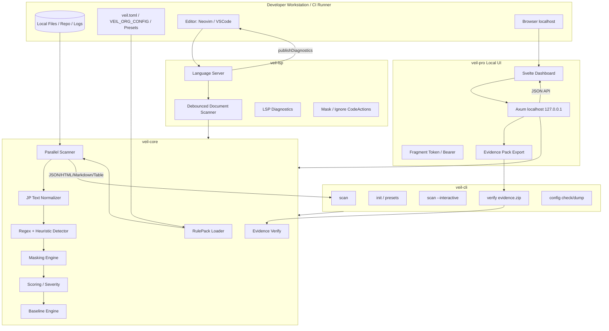
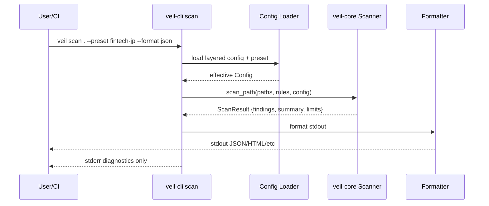
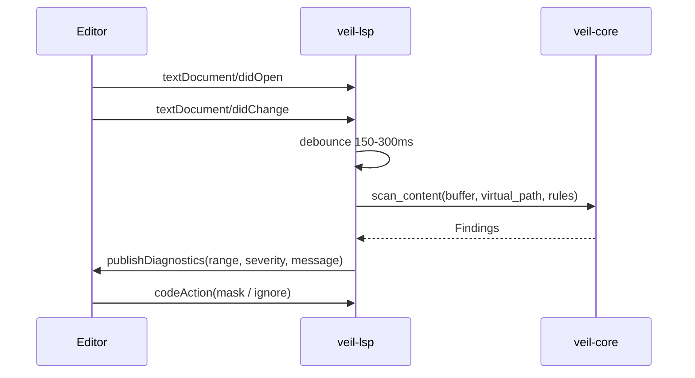
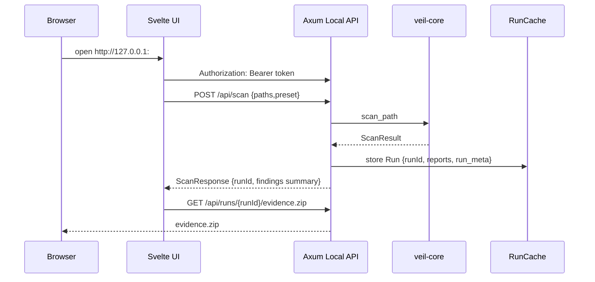

# 1. システム全体アーキテクチャ

## 1.1 アーキテクチャ原則

- **完全ローカル実行**: ソースコード、PII、スキャン結果、証跡ZIPを外部APIへ送信しない。SSO/remote rulesはEnterprise opt-inであり、通常起動では無効。
- **Core Engine集中**: 検知、マスキング、スコアリング、Evidence検証は `veil-core` に集約し、CLI / LSP / UI から再利用する。
- **UIは操作面、Coreは判定面**: Svelte UI は判断ロジックを持たず、Local APIを通じてCoreに委譲する。
- **監査可能性**: Scan結果は `schemaVersion` を持つ JSON と、Evidence Pack（ZIP）に保存できる。
- **CI遅延回避**: デフォルト除外、上限制御、並列スキャン、バイナリ/巨大ファイルスキップを標準化する。

## 1.2 全体構成図

## 1.3 データフロー

### CLI Scan

### LSP Real-time Detection

### Local Audit UI

## 1.4 主要crate / package

| 領域 | 既存/新規 | 主な責務 |
|---|---|---|
| `crates/veil-core` | 既存拡張 | スキャン、RulePack、JP正規化、マスキング、Evidence検証 |
| `crates/veil-config` | 既存拡張 | Config / Preset / Layering / Validation |
| `crates/veil-cli` | 既存拡張 | `scan`, `init`, `verify`, `scan --interactive`, `lsp` 起動 |
| `crates/veil-pro` | 既存拡張 | Local UI API、RunCache、Evidence Export、Svelte配信 |
| `crates/veil-lsp` | 新規 | LSP Server、Diagnostics、CodeActions |
| `crates/veil/rules_*` | 既存拡張 | Built-in RulePacks, JP preset packs |

## 1.5 Local-first と外部連携の境界

| 機能 | デフォルト | 有効化条件 | 外部へ出る情報 | 禁止事項 |
|---|---|---|---|---|
| Local UI | 有効 | `veil ui` | なし | `0.0.0.0` bind |
| SSO | 無効 | Enterprise opt-in: `VEIL_PRO_ENABLE_SSO=1` + 明示設定 | 認証メタデータのみ | ソース/PII/findings/Evidence送信 |
| Remote RulePack | 無効 | Enterprise opt-in: `core.allow_remote_rules=true` + `VEIL_ALLOW_NETWORK=1` | 署名付きRulePack取得要求 | ソース/PII/findingsアップロード |

通常モード・OSSモード・air-gapモードでは外部通信を発生させない。外部連携を有効化した場合も、解析対象や検出結果は端末外へ送信しない。
