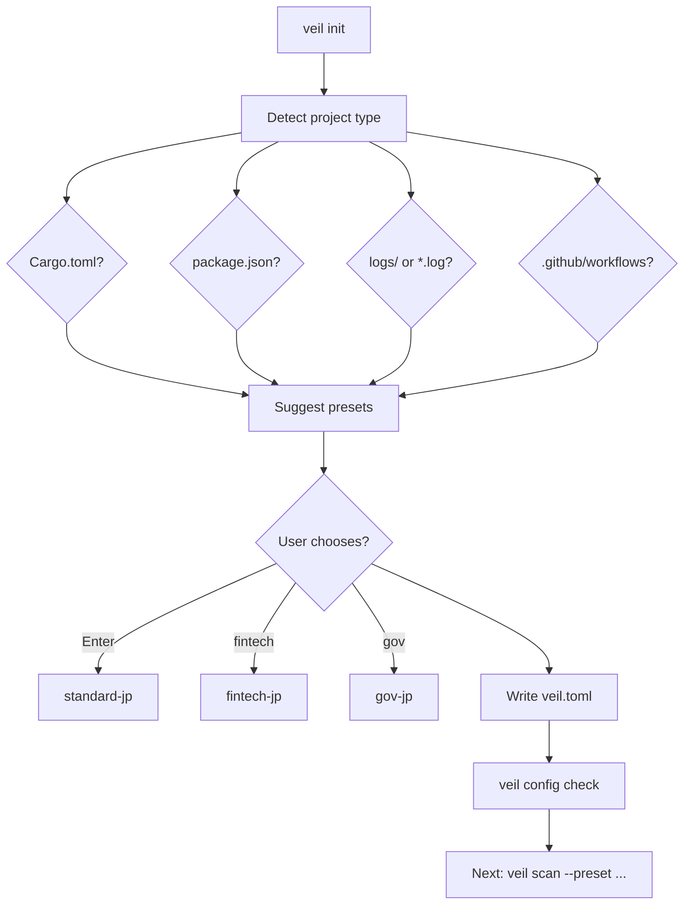
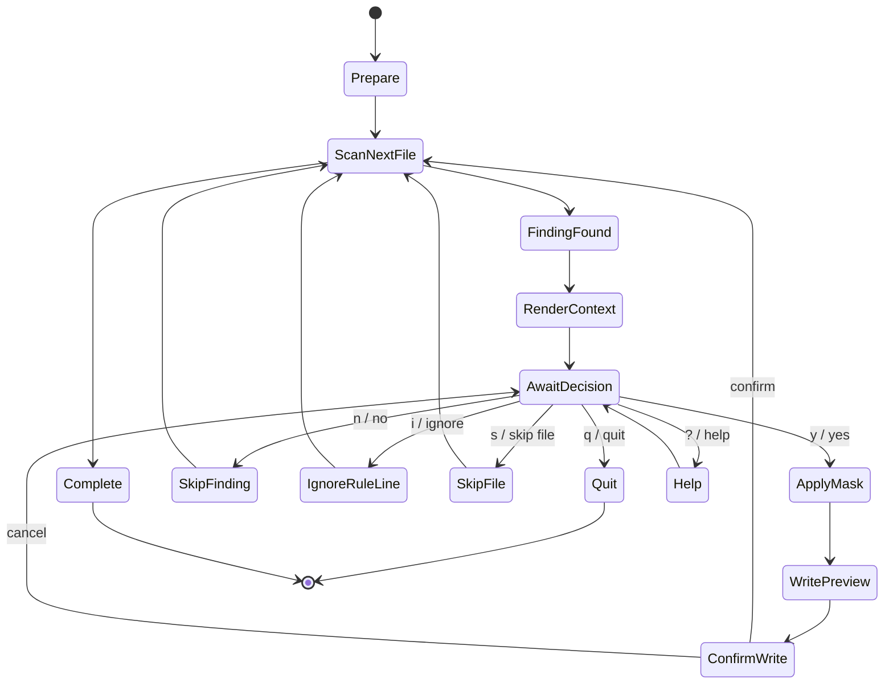
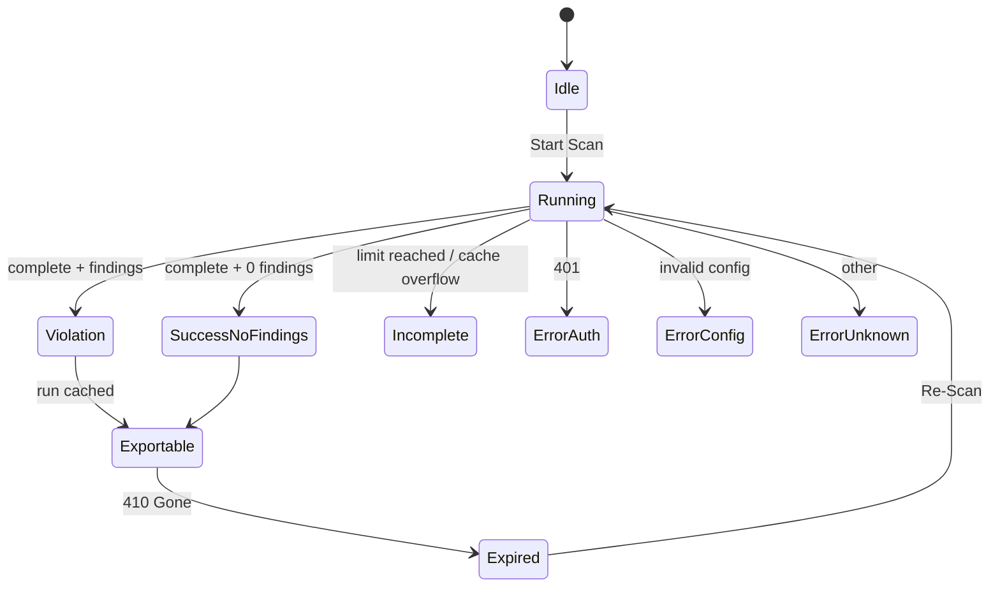

# 3. UX / コマンド体系設計

## 3.1 UX原則

- ユーザーに `.toml` を最初から書かせない。
- 最初の成功体験は `veil init` → `veil scan --preset fintech-jp` → `Evidence ZIP`。
- コードを書き換える前には必ず確認する。
- CIでは出力純度を絶対に壊さない。
- エラー時は What / Why / How を1画面で示す。

## 3.2 コマンド体系

```text
veil init [--wizard] [--preset fintech-jp|gov-jp|si-vendor-jp|logs-jp]
veil scan [paths...] [--preset ID] [--format text|json|html|markdown|table]
veil scan --interactive [paths...] [--preset ID]
veil scan --staged --preset fintech-jp
veil scan --fail-on-score 80 --fail-on-severity High --fail-on-findings 1
veil filter
veil mask [paths...] --dry-run
veil verify evidence.zip [--require-complete] [--expect-run-meta-sha256 HASH]
veil lsp --preset fintech-jp
veil ui [--no-open]
veil config check|dump|explain
veil rules list|explain
veil doctor
```

## 3.3 Zero-Config UX

### `veil init` の流れ


### Zero-Config出力例
```text
Detected: Rust workspace + GitHub Actions + Japanese README
Recommended preset: fintech-jp
Generated: veil.toml
Next: veil scan . --preset fintech-jp
```

## 3.4 Interactive CLI設計

### 状態遷移図


### 対話表示
```text
[HIGH 92] pii.jp.mynumber.keyword
file: src/sample.rs:42

Before:
  40 | let name = "山田 太郎";
> 42 | let id = "マイナンバー: 1234-5678-9012";
After mask preview:
> 42 | let id = "マイナンバー: <REDACTED>";

Action: [Y] mask / [n] skip / [i] add veil:ignore / [s] skip file / [?] help
> 
```

### 書き込み安全性
- デフォルトは dry-run preview。
- ファイル書き換え前にdiffを表示。
- 書き換えは atomic write。
- `--backup-suffix .bak` を指定可能。
- Git dirty状態なら警告。ただし強制停止しない。

## 3.5 CI向けUX

### 設計
- `stdout`: JSON/HTMLなど要求された機械出力のみ
- `stderr`: progress, warnings, limit reached, skipped dirs
- Exit 0: 成功
- Exit 1: policy violation
- Exit 2: tool/incomplete/error

### Fail threshold contract

`--fail-on-findings N` は **`>= N`** で判定する。例: `--fail-on-findings 1` はeffective findingが1件でもあればExit 1。

| option | 判定 | Exit |
|---|---|---:|
| `--fail-on-score N` | baseline suppress 後に `score >= N` のfindingあり | 1 |
| `--fail-on-severity S` | `score >= minScore(S)` のfindingあり | 1 |
| `--fail-on-findings N` | baseline suppress 後の effective findings 数が `>= N`。`N=0` は設定エラー | 1 |
| incomplete scan | coverage gap発生 | 2 |

`minScore`: Low=20, Medium=40, High=70, Critical=90。複数条件は OR。

### Skip / incomplete contract

| 種別 | 例 | status | Exit |
|---|---|---|---:|
| expected skip | `.gitignore`, `[core] ignore`, built-in heavy dirs | complete | 0/1 |
| unsupported binary skip | binary検出された画像/圧縮等 | complete | 0/1 |
| coverage skip | `max_file_size` 超過のtext/log/source | incomplete | 2 |
| traversal limit | `max_file_count` | incomplete | 2 |
| output truncation | `max_findings` | incomplete | 2 |
| read/config/rule error | permission, invalid regex | error | 2 |

### Limit Reached表示
```text
ERROR: Scan incomplete because max_file_count was reached.
WHY: CI must not pass when scan scope is incomplete.
HOW:
  - Narrow scope: veil scan src/ app/
  - Configure [core] ignore = ["dist", "target"]
  - Increase core.max_file_count if approved
```

## 3.6 UI UX状態機械




## 3.9 v4 Fail Flag契約

- `--fail-on-findings N` は `effectiveFindings >= N` で違反とする。
- `N=0` はCLI設定エラーで Exit 2。
- Local API の `failOnFindings=0` は HTTP 400 `INVALID_REQUEST`。
- fail判定はbaseline suppress後のeffective findingsのみを対象にする。
