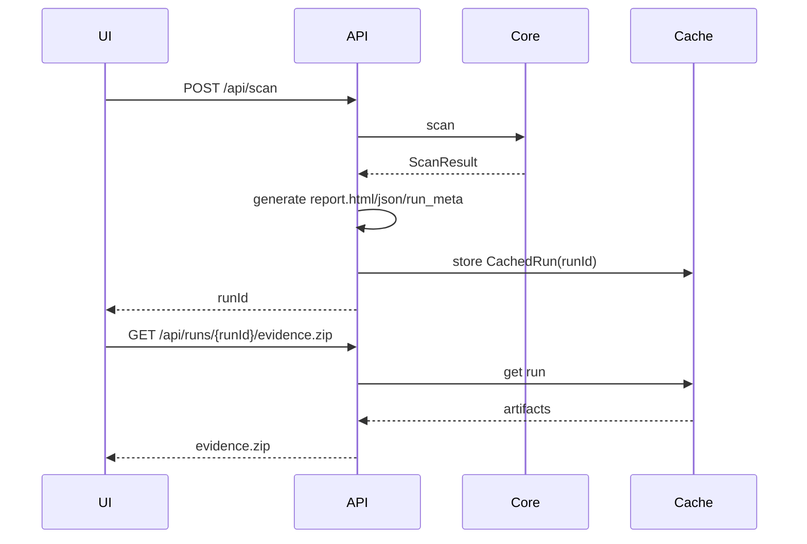

# 10. Evidence Pack / Verify 設計

## 10.1 目的

監査提出用の自己完結アーティファクトを生成し、第三者がオフラインで整合性・安全性を検証できるようにする。

## 10.2 ZIP内容

```text
report.html
report.json  # schemaVersion=veil-evidence-report-v1, raw-free all SafeFindingApiV1[]
effective_config.toml
run_meta.json
veil.baseline.json  # optional; baseline未使用時は含めない
```

## 10.3 baseline artifact naming

- Evidence ZIP 内の baseline entry は **`veil.baseline.json`** を正とする。
- baseline未使用時は ZIP に含めず、`run_meta.artifacts.baseline` もキーごと省略する。
- `baseline.json` はv1契約では使用しない。既存実装が出力している場合はリネームする。
- on-disk baselineの推奨名も `veil.baseline.json`。既存 `.veil-baseline.json` は読み取り互換のみ。

## 10.4 run_meta schema

- `schemaVersion = veil-pro-run-meta-v1`
- `engine.schemaVersion = veil-v1`
- artifactごとの sha256（ただし `run_meta.json` 自身のsha256は内部に持たない）
- result status / exit code equivalent
- limitReached / limitReasons
- privacy { telemetry:none, networkMode:local-only|enterprise-opt-in, bind:127.0.0.1 }

## 10.5 Export Flow



### 再スキャン禁止
Export時に再スキャンしない。UIで見た結果とZIPの結果が一致することを保証する。

## 10.6 Verify設計

### CLI
```bash
veil verify evidence.zip \
  --expect-run-meta-sha256 <hash> \
  --require-complete \
  --max-zip-bytes 524288000 \
  --max-entry-bytes 209715200 \
  --max-total-bytes 1073741824 \
  --max-files 64
```

### 検証項目
| 項目 | Exit |
|---|---:|
| ZIP破損 | 2 |
| ZipSlip path | 2 |
| ZipBomb limits | 2 |
| 必須ファイル欠落 | 2 |
| 重複エントリ | 2 |
| run_meta schema不一致 | 2 |
| report schema不一致（`schemas/json-schema.report.json`） | 2 |
| artifact sha mismatch | 2 |
| external anchor mismatch | 2 |
| token leakage | 2 |
| `--require-complete` に反する | 1 |
| findings閾値超過 | 1 |
| all ok | 0 |

## 10.7 外部アンカー

- `--expect-run-meta-sha256` は ZIP内 `run_meta.json` の **raw bytes SHA256**。
- `run_meta.json` は自分自身のsha256を内部に持たない。`artifacts.runMeta` は存在しない。
- JSON正規化後のhashではない。
- チケット/台帳に記録する。

## 10.8 tamper-evident表現

- 正: 改ざんがあれば検知できる。
- 誤: 改ざん不可、改ざん防止。

## 10.8.1 Evidence signing playbook

Evidence署名はZIP内部のv1契約を変更しない。署名対象は `run_meta.json` の raw bytes SHA256
を含むZIP外の小さな承認manifestとし、detached signatureまたは社内承認台帳で保持する。

詳細は `implementation/evidence_signing_playbook.md` を正とする。

## 10.9 token leak patterns

デフォルト検出:
```regex
#token=
\?token=
Authorization:\s*Bearer\s+[A-Za-z0-9._~-]{16,}
```

`Bearer`単独は誤検知源なので禁止しない。

## 10.10 Evidence Pack生成時の禁止

- raw matched_contentを含めない。
- UI tokenを含めない。
- Authorization headerを含めない。
- source pathは相対表示を優先。


## 10.9 v4 Evidence report / summary契約

- `report.json.findings` は raw-free な全findingを含める。
- baseline使用時は `baselineStatus="new"` と `baselineStatus="suppressed"` の両方を含める。
- Local API defaultとは異なり、Evidence report は監査提出物なのでsuppressed詳細も含める。
- `summary.totalFindings`, `summary.suppressedFindings`, `summary.effectiveFindings` は必須。
- `summary.severityCounts`, `summary.allSeverityCounts`, `summary.suppressedSeverityCounts` は必須。
- すべてのSeverityCountsは `Low` / `Medium` / `High` / `Critical` の4キーを必ず持つ。
- `coverageComplete=false` の場合、countsは観測済み範囲の集計でありrepo全体の推定値ではない。

## 10.10 v4 Evidence生成順

1. `report.html` を生成。
2. `report.json` を生成。
3. `effective_config.toml` を生成。
4. optional `veil.baseline.json` を確定。
5. 上記artifactのsha256とsizeBytesを計算。
6. `run_meta.json` を生成。`run_meta` 自身のsha256は内部に入れない。
7. ZIP化。
8. 必要ならZIP外で `run_meta.json` raw bytes SHA256 を表示し、`--expect-run-meta-sha256` の外部アンカーにする。

## 10.11 v4 Legacy Evidence互換

- `baseline.json` を含む旧Evidence ZIPは v1 verifier では Exit 2 とし、`veil.baseline.json` で再生成するよう案内する。
- unknown `schemaVersion` は strict fail。
