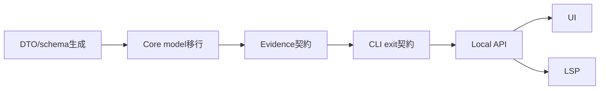

# 14. Bulk Implementation Safety SOT

この章は「全部まとめて実装」する場合の事故防止SOTである。危険なのは実装量そのものではなく、契約・型・schema・移行・テストが曖昧なまま同時に動くことである。

## 14.1 実装順序DAG



同一ブランチで実装しても、PR内の作業順序とコミット順はこのDAGに従う。

## 14.2 契約ON / 機能段階ON

- 契約ON: DTO名、schema名、field名、exit code、status、artifact名、score mapping は最初から固定する。
- 機能段階ON: 既存挙動を壊し得る機能は default off / feature flag / explicit command opt-in にする。

| 領域 | 契約 | 初期ON/OFF |
|---|---|---|
| DTO/schema | 常にON | ON |
| Evidence ZIP v1 | artifact名/schema固定 | ON |
| SSO | Enterprise opt-in | OFF |
| remote RulePack | Enterprise opt-in | OFF |
| LSP | `veil lsp` 明示起動 | OFF |
| Interactive mask write | `--interactive` 明示 | OFF |
| PDF生成 | HTML print CSS先行 | OFF |

## 14.3 互換/migration方針

| 旧入力 | 方針 | 失敗時 |
|---|---|---|
| Evidence ZIP `baseline.json` | 読まない。再生成を促す | Exit 2 `INVALID_EVIDENCE_SCHEMA` |
| on-disk `.veil-baseline.json` | 読み取り互換のみ許可 | warning |
| Rule `score` | migrationで `base_score` に変換 | warning |
| Rule `score` と `base_score` 両方 | `base_score` 優先 | warning |
| Rule `severity` override | migration専用 | warning |
| unknown run_meta/report schemaVersion | strict fail | Exit 2 |

## 14.4 Acceptance Gate

リリース候補は以下を1つのゲートとして通す。

```bash
cargo test --workspace
npm --prefix crates/veil-pro/frontend run build
python scripts/check_generated_schemas.py
cargo run -p veil-cli -- verify tests/fixtures/evidence/golden.zip --require-complete
```

`scripts/check_generated_schemas.py` は生成結果を一時ディレクトリに出力して tracked `schemas/` と比較する。acceptance gate 内で検証前に `schemas/` を上書きしてはならない。schema更新が必要なときだけ、開発者が明示的に `cargo run -p veil-pro --bin export_local_api_schema -- --out-dir schemas` を実行し、その差分をコミットする。

acceptance gate は PATH上の `veil` バイナリには依存しない。必ず `cargo run -p veil-cli -- verify ...` を使う。

実行用ラッパーは shell script ではなく `python scripts/check_contract_acceptance.py` とする。このラッパーは上記コマンド列を直列実行するだけで、正本はこの14.4のコマンド列である。

実運用ではCPU/端末安全のため直列実行を推奨する。CIでは各ステップを独立jobにしてもよいが、完了判定は同一ゲート名 `contract-acceptance` に集約する。

## 14.5 Rollback条件

| 落ちた層 | 戻す範囲 | 理由 |
|---|---|---|
| DTO/schema生成 | PR-0全体を戻す | schema差分は全層へ波及する |
| Core model移行 | Core model commitまで戻す | Evidence/CLI/UIへ伝播前に止血 |
| Evidence契約 | Evidence生成/verify commitを戻す | artifact名/sha/schemaは監査契約 |
| CLI exit契約 | CLI層のみ戻す | API/Schemaを巻き戻さない |
| Local API | API/UI commitを戻す | Core契約は維持 |
| UI | UI commitのみ戻す | Local API契約は維持 |
| LSP | LSP crate/commandのみ戻す | CLI/UIに影響させない |

Rollback時も `00_contract_decisions.md` を勝手に戻さない。契約自体を変える必要がある場合は、先にContract revisionを作る。

## 14.6 完了定義

- `scripts/check_generated_schemas.py` が差分なし。
- `schemas/` は生成結果と一致。
- Evidence golden ZIP が `cargo run -p veil-cli -- verify tests/fixtures/evidence/golden.zip --require-complete` で Exit 0。
- `--fail-on-findings 1` が effective finding 1件で Exit 1。
- `failOnFindings=0` が Local API 400 `INVALID_REQUEST`。
- `max_findings` 到達時の `coverageComplete=false` が API / report / run_meta で一致。


## v4.4 note

The acceptance gate remains the sole executable completion contract. RunMeta schema strictness (`result.limitReasons` required and `result.additionalProperties=false`) is verified through generated schema checks in PR-0.
