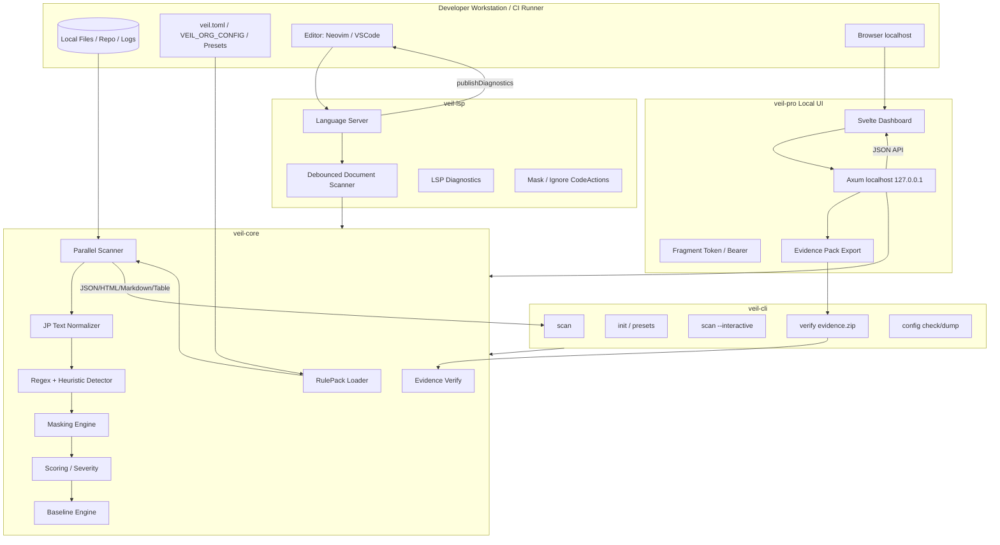
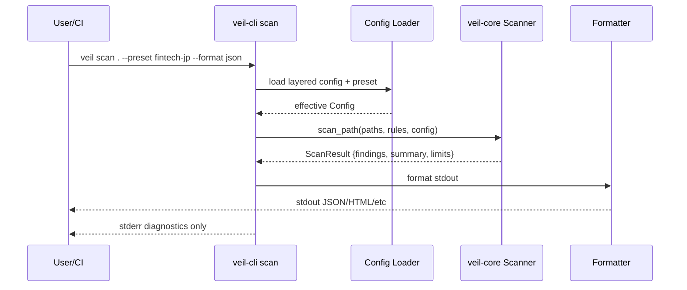
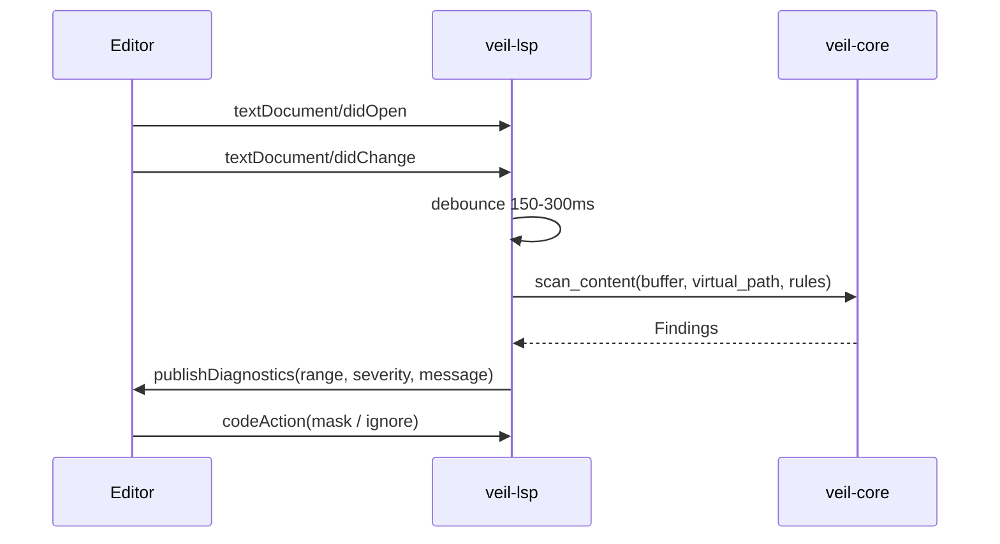
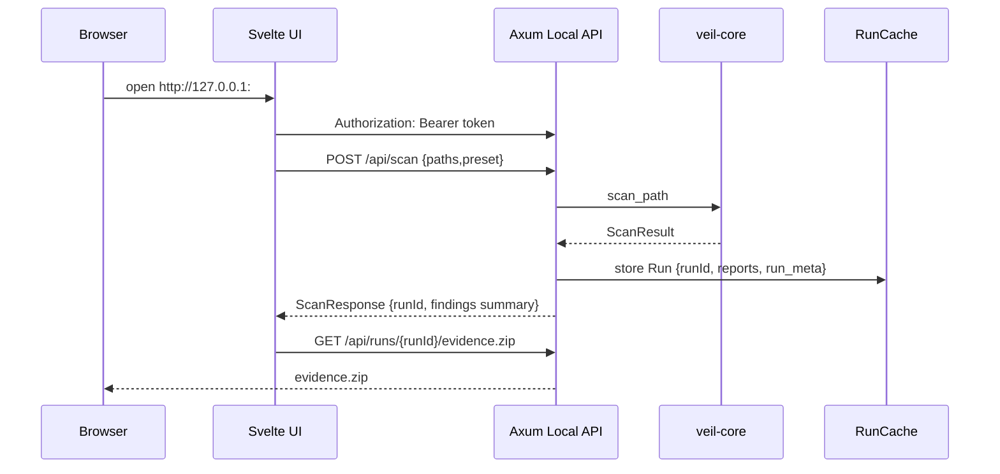
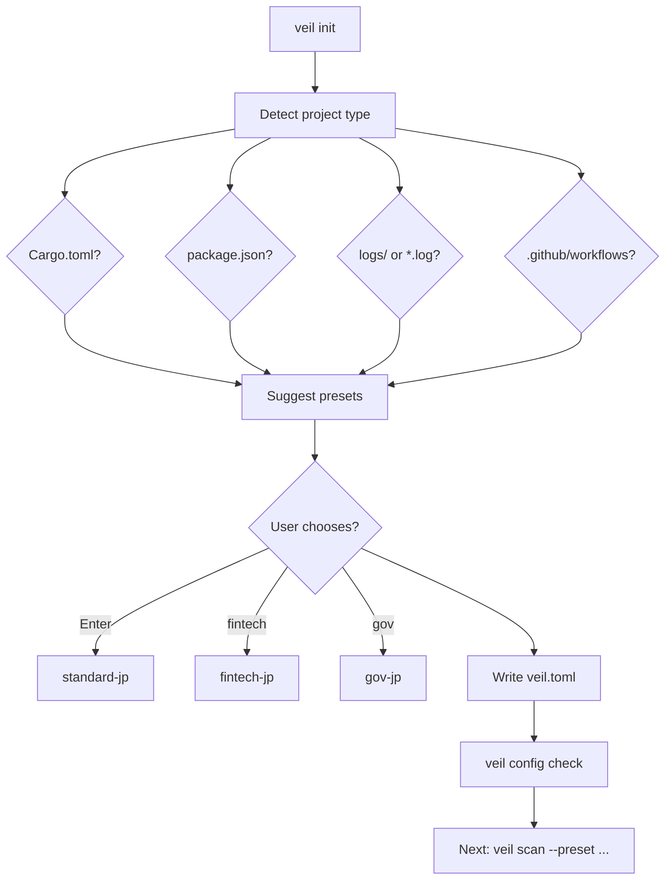
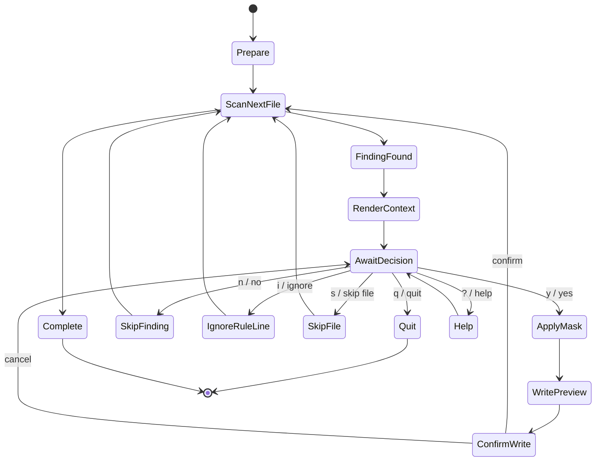
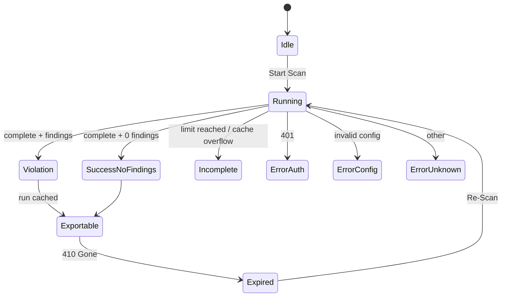
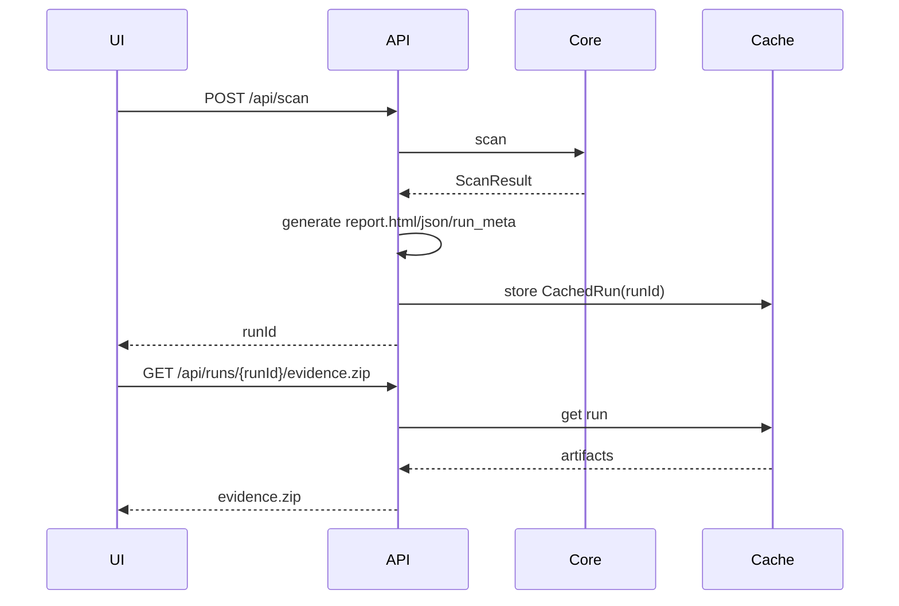
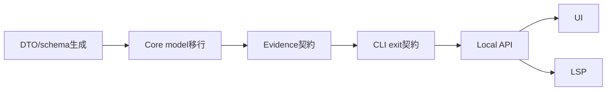

# veil-rs 国内エンタープライズ向け詳細設計書パック

## 対象
- 国内Fintech / 官公庁 / SIer 向け、完全ローカル実行の JP-PII / Secret 検知・マスキング・監査証跡ツール。
- 現行 `veil-rs` リポジトリを土台に、以下の実装対象を製品版として完成させる。
  - JP-PII 特化エンジン
  - Zero-Config / Preset Templates
  - Interactive CLI
  - LSP Integration
  - Local Audit UI
  - Evidence Pack / verify / 監査レポート

## 収録ドキュメント
| ファイル | 内容 |
|---|---|
| `00_contract_decisions.md` | 実装解釈割れを防ぐ契約決定SOT |
| `01_system_architecture.md` | Mermaid図付きの全体アーキテクチャ |
| `02_component_design.md` | Core / CLI / LSP / UI / Evidence / RulePack の責務とI/O |
| `03_ux_command_design.md` | CLI/UX設計、Interactive CLI状態遷移図 |
| `04_jp_pii_detection_strategy.md` | マイナンバー、住所、氏名、電話、クレカ等の検知戦略 |
| `05_local_audit_ui_api_schema.md` | Local Server ⇔ Svelte APIスキーマ |
| `06_lsp_design.md` | Language Server Protocol 設計 |
| `07_zero_config_and_presets.md` | `veil init` / `--preset` の設計 |
| `08_security_privacy_design.md` | ローカルファースト、CSP、権限、証跡の設計 |
| `09_performance_limits.md` | CI遅延を避ける性能・上限制御設計 |
| `10_evidence_pack_and_verify.md` | 監査証跡ZIPと第三者検証設計 |
| `11_data_model.md` | Finding / Rule / Config / RunMeta のデータモデル |
| `12_testing_strategy.md` | テスト戦略、fixtures、E2E、性能テスト |
| `13_implementation_roadmap.md` | 実装ロードマップ、PR分割、受け入れ条件 |
| `14_bulk_implementation_safety.md` | 一括実装時の順序DAG、feature flag、互換、acceptance gate、rollback条件 |
| `15_contract_confidence_audit.md` | 既知loopholeとv4.4処置の自己監査 |
| `schemas/openapi.local-api.yaml` | Local UI APIのOpenAPI風スキーマ |
| `schemas/json-schema.finding.json` | Finding JSON Schema |
| `schemas/json-schema.safe-finding-api.json` | Local API / Evidence用 SafeFinding JSON Schema |
| `schemas/json-schema.run-meta.json` | RunMeta JSON Schema |
| `schemas/json-schema.report.json` | Evidence report.json JSON Schema |
| `templates/presets/*.toml` | プリセットTOML案 |
| `implementation/task_breakdown.md` | 実装タスクのチェックリスト |
| `implementation/risk_register.md` | 技術・UX・営業上のリスク管理 |

## SOT方針
- 正本優先順は `00_contract_decisions.md` → Rust DTO/Core型 → 生成OpenAPI/JSON Schema → 各章本文。
- 既存の `veil-core`, `veil-cli`, `veil-pro` 実装を活かし、不足機能は差分実装として明記する。
- 外部送信、クラウド集約、0.0.0.0公開は製品思想と矛盾するため、対象外。


## v4.4 contract note

- 実装時は `00_contract_decisions.md` を最上位SOTとし、`PR-0 Contract Alignment` から開始する。
- acceptance gate の唯一の正本は `14_bulk_implementation_safety.md` の `14.4 Acceptance Gate`。
- 実装repoでは本設計パックを `docs/design/enterprise_jp_pii/` に配置する。`.private/` は作業用コピーであり、PR正本にはしない。
- schema正本は repo root `schemas/`。設計パック内 `schemas/` は参照コピー。
- RunMeta `result` は `limitReasons` required かつ `additionalProperties=false`。
- v4.4 は PR-0 Contract Alignment 直前の schema strictness sync 版。

---

# 0. Contract Decisions / Implementation-Blocking Ambiguity Resolution v4.4

この文書は、設計書群の実装解釈割れを防ぐための最上位SOTである。実装時に他章と矛盾する場合は、本章を優先し、該当章・schema・テストを同時に修正する。

## D-000 PR-0: Contract Alignment を最初に実装する

本設計書を実装に落とす最初のPRは **Contract Alignment PR** とする。機能追加ではなく、型・schema・生成・検証の正本を作る。

### D-000.1 正本ファイル

PR-0で以下を追加する。

- `crates/veil-pro/src/api/dto.rs`
  - Local API DTO の正本。
  - `#[serde(rename_all = "camelCase")]` を使う。
  - `schemars::JsonSchema` と `utoipa::ToSchema` をderiveできる型にする。
- `crates/veil-pro/src/bin/export_local_api_schema.rs`
  - Rust DTOから `schemas/openapi.local-api.yaml` と `schemas/json-schema.*.json` を生成する。
- `scripts/check_generated_schemas.py`
  - 生成結果とtracked schemaの差分を検査する。
  - **この名前を唯一のschema検証スクリプト名とする**。`validate_generated_schemas.py` は使用しない。
- `schemas/openapi.local-api.yaml`
- `schemas/json-schema.safe-finding-api.json`
- `schemas/json-schema.report.json`
- `schemas/json-schema.run-meta.json`
- `schemas/json-schema.finding.json`

### D-000.2 schema出力先

PR-0の出力先は **repo root の `schemas/`** とする。設計書パック内の `schemas/` は同じ内容の参照コピーであり、実装時の正規出力先ではない。

schema更新時の生成コマンド契約:

```bash
cargo run -p veil-pro --bin export_local_api_schema -- --out-dir schemas
```

schema検証コマンド契約:

```bash
python scripts/check_generated_schemas.py
```

`scripts/check_generated_schemas.py` は一時ディレクトリへ生成して tracked `schemas/` と比較する。acceptance gate では検証前に `schemas/` を上書きしてはならない。

実装者は OpenAPI / JSON Schema を手編集してはならない。

### D-000.3 schema生成crate

- JSON Schema: `schemars`
- OpenAPI: `utoipa`
- DTOは `serde`, `schemars::JsonSchema`, `utoipa::ToSchema` を同じRust型にderiveする。
- `utoipa` で表現しづらいschema制約（例: `baseline.path` const）は、生成後patchではなくDTO/Schema helperで生成できる形に寄せる。どうしても不可の場合は `export_local_api_schema` 内の deterministic post-process とし、`check_generated_schemas.py` が差分を検知する。

## D-001 API / Schema SOT

- **正本**: Rust DTO (`crates/veil-pro/src/api/dto.rs`)。
- `schemas/openapi.local-api.yaml` と JSON Schema は、Rust DTO から生成される派生物。
- Local API は **camelCase** を使う。
- CLI JSON (`schemaVersion: veil-v1`) は既存互換のため **snake_case** を維持する。
- `SafeFindingApiV1` は Local UI / Evidence preview / Evidence report 用の raw-free DTO。
- `FindingV1` は CLI/Core互換用。rawを含み得る内部/CLI用schemaであり、Local UIには返さない。

## D-002 ScanRequest.paths

- `paths` は省略可能。
- `paths` が省略または空配列の場合、APIは `['.']` に正規化する。
- 空配列をエラーにしない。UIの空入力は “repo root” の意図として扱う。

## D-003 Evidence ZIP baseline entry

- Evidence ZIP 内の baseline artifact 名は **`veil.baseline.json`** とする。
- baseline は任意。baseline未使用時は ZIP に入れず、`run_meta.artifacts.baseline` も省略する。
- `baseline.json` は v1契約では使用しない。
- on-disk の推奨 baseline 名も `veil.baseline.json` とする。既存 `.veil-baseline.json` は読み取り互換のみ許可する。
- `run_meta.artifacts.baseline.path` は schema/verify の両方で `veil.baseline.json` に固定する。

## D-004 run_meta self-hash 禁止

`run_meta.json` は **自分自身のsha256を内部に持たない**。

理由:

- `run_meta.json` 内に `run_meta.json` のhashを含めると自己参照になり、通常の一回生成では安定値を作れない。
- Evidence Packの外部アンカーは `veil verify --expect-run-meta-sha256 <hex>` で扱う。

契約:

- `run_meta.artifacts.runMeta` は存在しない。
- `run_meta.json` の raw bytes SHA256 は verifier / 監査台帳 / チケット側で外部アンカーとして扱う。
- `report.html`, `report.json`, `effective_config.toml`, optional `veil.baseline.json` のsha256は `run_meta.artifacts.*` に保持する。

## D-005 Local-first / SSO / Remote Rules

- デフォルトモードは完全ローカル・外部通信なし。
- SSO と remote rule download は v1の通常起動では無効。
- SSO は **Enterprise opt-in**。有効化には `VEIL_PRO_ENABLE_SSO=1` と明示設定が必要。
- Remote rules は **Enterprise opt-in**。`core.allow_remote_rules = true` と `VEIL_ALLOW_NETWORK=1` が両方必要。
- SSO/remote rules 有効時でも、ソース/PII/findings/Evidenceのアップロードは禁止。
- `privacy.networkMode` は `local-only | enterprise-opt-in`。
- デフォルトの `networkMode` は `local-only`。

## D-006 Presets / Precedence

- v1で提供する preset は5種: `standard-jp`, `fintech-jp`, `gov-jp`, `si-vendor-jp`, `logs-jp`。
- `minimal-ci` は preset ではない。`mode = ci` / `--staged` / fail flags / scope制限で表現する。
- `--preset` は “base layer” として適用し、`VEIL_ORG_CONFIG`, repo config, explicit CLI flags が上書きできる。
- この直感ズレは `veil config explain` で必ず説明する。
- `veil scan --preset ...` 実行時、repo config が preset由来値を上書きした場合は stderr に説明を出す。
- PR-0でpreset layerを実装しないsurfaceは、preset指定を HTTP 400 `INVALID_REQUEST` として拒否する。presetを受け取って黙って無視してはならない。

## D-007 Score / Grade / Severity / Fail Conditions

- `score` は最終リスクスコア（0-100）。validator/context/baseline適用前後で最終値を確定する。
- `grade` は score から決定されるUI/レポート用バンド。
- `severity` は `grade` から `Safe` を除いた互換フィールド。public API / CLI に出るfindingは原則 `Low` 以上。

| score | grade | severity | CI threshold alias |
|---:|---|---|---|
| 0-19 | Safe | 出力しない（verbose時のみLow扱い） | - |
| 20-39 | Low | Low | `--fail-on-severity Low` |
| 40-69 | Medium | Medium | `--fail-on-severity Medium` |
| 70-89 | High | High | `--fail-on-severity High` |
| 90-100 | Critical | Critical | `--fail-on-severity Critical` |

Fail判定は baseline suppress 後の **effective findings** に対して行う。

- `--fail-on-score N`: `score >= N` の effective finding が1件以上あれば Exit 1。
- `--fail-on-severity S`: `score >= minScore(S)` の effective finding が1件以上あれば Exit 1。
- `--fail-on-findings N`: `effectiveFindings >= N` なら Exit 1。`N` は1以上。`N=0` は設定エラー。
- Local API の `failOnFindings=0` は HTTP 400 `INVALID_REQUEST`。
- 複数fail条件は OR。

## D-008 Baseline counting contract

Local API / Evidence report は件数の意味を以下に固定する。

- `totalFindings`: baseline適用前の全finding数。
- `suppressedFindings`: baselineにより抑制されたfinding数。
- `effectiveFindings`: baseline suppress 後に残るfinding数。CI fail判定の対象。
- `severityCounts`: effective findings のseverity集計。
- `allSeverityCounts`: baseline適用前の全finding集計。
- `suppressedSeverityCounts`: suppressed findings のseverity集計。**必須フィールド**。
- すべての `SeverityCounts` は zero-filled map とし、`Low` / `Medium` / `High` / `Critical` の4キーを必ず持つ。0件でもキー省略は禁止。
- Local API `findings`: デフォルトでは effective findings のみを返す。
- Local API `includeSuppressed=true` の場合のみ、`baselineStatus="suppressed"` のfindingを含めて返す。
- Evidence `report.json.findings`: 監査用提出物のため、raw-free な全finding（`new` と `suppressed`）を常に含める。

## D-009 Rule score contract

Rule側のリスク初期値は **`base_score`** のみを正とする。

- Rule定義に `score` は使わない。
- preset TOML も rule override は `base_score` のみを使う。
- 既存RulePackの `score` はmigrationで `base_score` へ移す。
- Finding側の `score` は validator/context/negative context 適用後の最終値。
- Rule側の `severity` はv1新規設計では使わない。互換読み込みが必要な場合のみ `severity` から `base_score` へ変換する。
- 互換入力としての `severity` は **migration専用** であり、新規presetや新規RulePackには出さない。

互換migrationの優先順位は以下に固定する。

| 入力 | 変換後 `base_score` | warning |
|---|---:|---|
| `base_score` のみ | `base_score` | なし |
| `base_score` + `score` | `base_score` | `score ignored because base_score is canonical` |
| `base_score` + `severity` | `base_score` | `severity ignored because base_score is canonical` |
| `score` のみ | `score` | `legacy score migrated to base_score` |
| `score` + `severity` | `score` | `legacy severity ignored because score is more precise` |
| `severity` のみ | 下表 | `legacy severity migrated to base_score` |

| legacy `severity` | `base_score` |
|---|---:|
| `Low` | 20 |
| `Medium` | 40 |
| `High` | 70 |
| `Critical` | 90 |

`Info` はv1では無効。読み込み時は設定エラーとして扱い、`Low` へ暗黙変換しない。

## D-010 LSP Span Contract

- `masked_snippet` は表示専用。編集範囲の復元には使わない。
- Coreのinternal findingは raw textを外に出さず、`FindingSpan { byte_start, byte_end }` と `Range { start, end }` を保持する。
- LSP Diagnostic range / CodeAction edit は `Range { start: Position, end: Position }` から生成する。
- `Position.character` はUTF-16 code units。
- DTO名は `Range` で統一し、`utf16_range` はフィールド名としてのみ使う。
- `veil:ignore` の挿入は言語別コメント構文で行う。コメント非対応形式（JSON等）は inline ignore code action を出さない。

## D-011 Skip / Incomplete / Exit 2

- user-configured ignore, `.gitignore`, built-in heavy dirs, unsupported binary skip は expected skip。scan complete として扱う。
- `max_file_count`, `max_findings`, text/log/source file `max_file_size` 超過、permission/read error, rule/config error は coverage gap。status=`incomplete` または `error`、Exit 2。
- oversized binary は expected skip。oversized text/log/source は incomplete。

## D-012 Evidence report.json schema

Evidence ZIP内 `report.json` は `EvidenceReportV1` schemaを使う。

- schema file: `schemas/json-schema.report.json`
- `schemaVersion`: `veil-evidence-report-v1`
- `summary.suppressedSeverityCounts` は必須。
- `findings`: `SafeFindingApiV1[]`。raw matched contentを含めない。
- `findings` は **raw-free な全finding** を含める。baseline使用時は `baselineStatus="new"` と `baselineStatus="suppressed"` の両方を含める。
- `summary`: total/effective/suppressed countsを含む。
- CLIの `veil scan --format json` は既存 `schemaVersion: veil-v1` であり、Evidence reportとは別契約。

## D-013 Repo hygiene

- `.gitignore` に `.codex/` を追加する。
- `.design/` と `.private/` はローカル設計/営業SOTであり、原則git管理しない。

## D-014 BaselineStatus rules

`SafeFindingApiV1.baselineStatus` は以下に固定する。

| 状態 | baselineStatus | findings配列への出現 |
|---|---|---|
| baseline未使用 | `none` | 通常返す |
| baseline使用・新規/未抑制 | `new` | 通常返す |
| baseline使用・抑制済み | `suppressed` | `includeSuppressed=true` の場合のみ |

## D-015 Limit / max_findings response contract

`max_findings` 等のcoverage limitに到達した場合:

- `status = "incomplete"`
- CLI Exit 2 / Local API HTTP 200 + status incomplete（API transport自体は成功）
- `limitReached = true`
- `limitReasons` に `max_findings` / `max_file_count` / `max_file_size_text` 等を入れる
- `coverageComplete = false`
- summary counts は **観測できた範囲の集計**。repo全体の推定値ではない。
- `findings` 配列は stable order の先頭から `max_findings` までの emitted findings。
- `Evidence ZIP` は生成可能だが `run_meta.result.status=incomplete` となる。`veil verify --require-complete` は Exit 1。

## D-016 Evidence generation order

Evidence ZIP生成順は以下に固定する。

1. `report.html` 生成
2. `report.json` 生成
3. `effective_config.toml` 生成
4. optional `veil.baseline.json` を確定
5. 上記artifactの sha256 / sizeBytes を計算
6. `run_meta.json` を生成（自分自身のsha256は入れない）
7. ZIP化
8. 必要に応じて、ZIP外で `run_meta.json` raw bytes SHA256 を外部アンカーとして表示/記録

## D-017 RunMetaResponse contract

`GET /api/runs/{runId}` は **full RunMetaV1** を返す。

- Evidence ZIP 内の `run_meta.json` と同じ構造を返す。
- `artifacts.*.sha256` は含める。
- `run_meta` 自身のsha256は含めない。
- UIが軽量表示をしたい場合は、クライアント側で必要フィールドを抜き出す。別subset DTOはv1では作らない。

## D-018 Compatibility / migration policy

- 既存 Evidence ZIP が `baseline.json` を含む場合、v1 verifier は `INVALID_EVIDENCE_SCHEMA` 相当の Exit 2 とし、メッセージで `veil.baseline.json` への再生成を促す。
- 既存 `.veil-baseline.json` は入力として読み取り互換を許可するが、Evidence ZIP 出力名は `veil.baseline.json` のみ。
- 既存 RulePack の `score` / `severity` は D-009 の優先順位表で `base_score` へ変換する。
- `base_score` がある場合は常に `base_score` を優先する。`score + severity` のみの場合は `score` を優先する。
- migration warning はstderrまたは `veil config explain` に出す。
- 旧 `severity` rule override はmigration専用。新規presetには書かない。
- 旧 schemaVersion の Evidence report / run_meta は strict に Exit 2。forward compatibility は v2設計時に明示実装する。

## D-019 Bulk implementation safety SOT

全機能を同一ブランチでまとめて実装する場合でも、内部順序・ON/OFF・rollback条件は固定する。詳細は `14_bulk_implementation_safety.md` を最優先で参照する。

要約:

```text
DTO/schema生成
→ Core model移行
→ Evidence契約
→ CLI exit契約
→ Local API
→ UI
→ LSP
```

契約は最初からON、既存挙動を壊す機能は段階ONにする。


## D-023 Finding ID / baseline fingerprint contract

`findingId` と `baselineFingerprint` は別物として維持する。

- `findingId`: Local API / Evidence / UI操作で使う表示・相関ID。
- `baselineFingerprint`: baseline suppress照合に使う長期安定キー。
- `veil.baseline.json` 内のJSON field名は既存互換のため `fingerprint` とし、API/Evidence field名 `baselineFingerprint` とは分ける。
- baseline照合で `findingId` を使ってはならない。
- `findingId == baselineFingerprint` を仮定してはならない。
- どちらも raw secret を含まない opaque identifier とする。

この契約は現行実装の `baseline fingerprint` と `FindingId` が別に存在する前提を維持し、移行時に統合しない。

## D-024 RunMeta strict extension contract

RunMeta v1 は audit contract として strict schema を採用する。

- root `additionalProperties=false`。
- 将来拡張は `extensions: Record<string, unknown>` の専用namespaceにのみ入れる。
- v1 core fields に未知keyを混入させない。


### Product metadata

`RunMetaV1.product.name` は v1 では `"veil-pro" | "veil"` の列挙値に固定する。Local Audit UI から生成される Evidence は通常 `"veil-pro"`、将来 CLI 生成Evidenceを許可する場合のみ `"veil"` を使う。自由な string にはしない。


## D-021 RunMeta.result required fields and strictness

`RunMetaV1.result` is a strict v1 object. It MUST include `limitReasons` even when the array is empty. Unknown keys directly under `result` are forbidden. Future result-level extensions MUST use the top-level `extensions` namespace, not ad-hoc keys under `result`.

Canonical Rust DTO contract:

```rust
pub struct RunResultMeta {
    pub status: RunStatus,
    pub exit_code: u8,
    pub limit_reached: bool,
    pub limit_reasons: Vec<String>, // required, may be []
    pub summary: EvidenceSummary,
}
```

Schema/OpenAPI contract:

- `result.required` includes `status`, `exitCode`, `limitReached`, `limitReasons`, `summary`.
- `result.additionalProperties = false`.
- `limitReasons=[]` is required for complete non-limited runs.

---

# 1. システム全体アーキテクチャ

## 1.1 アーキテクチャ原則

- **完全ローカル実行**: ソースコード、PII、スキャン結果、証跡ZIPを外部APIへ送信しない。SSO/remote rulesはEnterprise opt-inであり、通常起動では無効。
- **Core Engine集中**: 検知、マスキング、スコアリング、Evidence検証は `veil-core` に集約し、CLI / LSP / UI から再利用する。
- **UIは操作面、Coreは判定面**: Svelte UI は判断ロジックを持たず、Local APIを通じてCoreに委譲する。
- **監査可能性**: Scan結果は `schemaVersion` を持つ JSON と、Evidence Pack（ZIP）に保存できる。
- **CI遅延回避**: デフォルト除外、上限制御、並列スキャン、バイナリ/巨大ファイルスキップを標準化する。

## 1.2 全体構成図



## 1.3 データフロー

### CLI Scan


### LSP Real-time Detection


### Local Audit UI


## 1.4 主要crate / package

| 領域 | 既存/新規 | 主な責務 |
|---|---|---|
| `crates/veil-core` | 既存拡張 | スキャン、RulePack、JP正規化、マスキング、Evidence検証 |
| `crates/veil-config` | 既存拡張 | Config / Preset / Layering / Validation |
| `crates/veil-cli` | 既存拡張 | `scan`, `init`, `verify`, `scan --interactive`, `lsp` 起動 |
| `crates/veil-pro` | 既存拡張 | Local UI API、RunCache、Evidence Export、Svelte配信 |
| `crates/veil-lsp` | 新規 | LSP Server、Diagnostics、CodeActions |
| `crates/veil/rules_*` | 既存拡張 | Built-in RulePacks, JP preset packs |

## 1.5 Local-first と外部連携の境界

| 機能 | デフォルト | 有効化条件 | 外部へ出る情報 | 禁止事項 |
|---|---|---|---|---|
| Local UI | 有効 | `veil ui` | なし | `0.0.0.0` bind |
| SSO | 無効 | Enterprise opt-in: `VEIL_PRO_ENABLE_SSO=1` + 明示設定 | 認証メタデータのみ | ソース/PII/findings/Evidence送信 |
| Remote RulePack | 無効 | Enterprise opt-in: `core.allow_remote_rules=true` + `VEIL_ALLOW_NETWORK=1` | 署名付きRulePack取得要求 | ソース/PII/findingsアップロード |

通常モード・OSSモード・air-gapモードでは外部通信を発生させない。外部連携を有効化した場合も、解析対象や検出結果は端末外へ送信しない。

---

# 2. コンポーネント別詳細設計

## 2.1 veil-core

### 責務
- RulePack読み込み・検証
- ファイルシステム走査
- JPテキスト正規化
- PII / Secret検出
- マスキング
- スコアリング
- Baseline適用
- Evidence Pack検証

### Public API案
```rust
pub fn scan_path(root: &Path, rules: &[Rule], config: &Config) -> ScanResult;
pub fn scan_content(content: &str, path: &Path, rules: &[Rule], config: &Config) -> Vec<Finding>;
pub fn apply_masks(content: &str, ranges: Vec<Range<usize>>, mode: MaskMode, placeholder: &str) -> String;
pub fn verify_evidence_pack(path: &Path, options: VerifyOptions) -> Result<VerifyResult, VerifyError>;
pub fn normalize_jp_text(input: &str, policy: NormalizationPolicy) -> NormalizedText;
pub fn validate_jp_identifier(kind: JpIdentifierKind, raw: &str) -> ValidationOutcome;
```

### I/O
| 入力 | 出力 | 備考 |
|---|---|---|
| `Path`, `Config`, `Vec<Rule>` | `ScanResult` | 並列scan。unsupported/oversized binary は expected skip。text/log/source の oversize は coverage gap として incomplete |
| `&str`, `Path`, `Config` | `Vec<Finding>` | LSP/Filter/Unit testで使用 |
| `Evidence ZIP`, `VerifyOptions` | `VerifyResult` | ZipSlip/Bomb/Hash/Schema/Token leak検査 |

### 内部モジュール案
| モジュール | 役割 |
|---|---|
| `scanner` | WalkBuilder + rayon による高速走査 |
| `scanner::jp_normalize` | 全角/半角/ハイフン/スペース正規化 |
| `rules` | RulePack読込、manifest順序、validator関連付け |
| `validators::jp` | MyNumber / Luhn / 住所/電話などの検証器 |
| `masking` | Redact/Partial/Plain。ただしplainはCLI明示のみ |
| `baseline` | 既存Findingのsnapshot化・抑制 |
| `verify` | Evidence Pack検証 |

## 2.2 veil-config

### 責務
- `veil.toml` / `veil.ci.toml` / `VEIL_ORG_CONFIG` / preset の合成
- 安全境界の検証
- Zero-Configの推論結果を Config に落とす

### Config Layer順序
```text
built-in defaults
→ preset template
→ org config (VEIL_ORG_CONFIG)
→ repo config (veil.toml)
→ CLI flags
```

### API案
```rust
pub fn load_config_layers(input: LoadConfigInput) -> Result<ConfigLayers>;
pub fn apply_preset(base: Config, preset: PresetId) -> Result<Config>;
pub fn validate_config(config: &Config) -> Result<()>;
pub fn explain_effective_config(config: &ConfigLayers) -> EffectiveConfigExplanation;
```

### PresetId
```rust
pub enum PresetId {
    StandardJp,
    FintechJp,
    GovJp,
    SiVendorJp,
    LogsJp,
}
```

## 2.3 veil-cli

### 責務
- コマンド引数を解析し、Coreへ委譲
- stdout/stderr purityを保証
- Interactive CLI状態制御
- Evidence verify
- LSP起動コマンドの提供

### 主要コマンド
| コマンド | 責務 |
|---|---|
| `veil init` | Zero-Config初期化。環境検出、プリセット選択、CI雛形生成 |
| `veil scan` | ローカル/CIスキャン |
| `veil scan --interactive` | 対話式マスキング/無視/スキップ |
| `veil scan --preset fintech-jp` | プリセット即時適用 |
| `veil verify evidence.zip` | Evidence Pack検証 |
| `veil lsp` | Language Server起動 |
| `veil ui` | Local Audit UI起動（または `veil-pro` ラップ） |

## 2.4 veil-lsp（新規）

### 責務
- LSP標準に準拠し、エディタ上にPII/Secret警告を表示
- 保存前に検知し、シフトレフトを実現
- オフライン・ローカルのみ

### 入出力
| LSPイベント | 処理 | 出力 |
|---|---|---|
| `initialize` | Config/Preset読み込み | capabilities |
| `textDocument/didOpen` | buffer scan | diagnostics |
| `textDocument/didChange` | debounce scan | diagnostics |
| `textDocument/codeAction` | mask/ignore候補 | workspace edit |
| `workspace/didChangeConfiguration` | config再読込 | diagnostics再計算 |

## 2.5 veil-pro Local Server

### 責務
- `127.0.0.1` のみでSvelte UIを配信
- Token認証 / CSP / no-store / no-referrer
- Scan API, Evidence Export API
- RunCache TTL/容量制御

### I/O
| Endpoint | 入力 | 出力 |
|---|---|---|
| `GET /api/me` | Bearer token | `AuthContext` |
| `GET /api/projects` | なし | `ProjectsResponse` |
| `POST /api/scan` | `ScanRequest` | `ScanResponse` |
| `GET /api/runs/{id}` | run_id | `RunMetaResponse` |
| `GET /api/runs/{id}/evidence.zip` | run_id | ZIP |
| `POST /api/baseline` | `BaselineRequest` | `BaselineResponse` |
| `GET /api/policy` | なし | `PolicyResponse` |
| `GET /api/doctor` | なし | `DoctorResponse` |

## 2.6 Svelte UI

### 責務
- ユーザー操作面
- Findings可視化
- Baseline作成
- Policy表示
- Evidence ZIP export

### 画面構成
| 画面 | 主CTA | 補助CTA |
|---|---|---|
| Projects | Add/Open Project | Recent |
| Scan | Start Scan | Preset select |
| Findings | Export Evidence ZIP | Filter / Search |
| Baseline | Create Baseline | View baseline |
| Policy | View Effective Config | Copy diagnostics |
| Doctor | Export Doctor Snapshot | Copy env info |

## 2.7 Evidence Pack

### 内容
```text
report.html
report.json
effective_config.toml
run_meta.json
veil.baseline.json  // optional; baseline未使用時は含めない
```

### 契約
- ZIP内パス固定
- raw secretを含めない
- `run_meta.json` raw bytes SHA256を外部アンカーにできる
- `veil verify` は構造、schema、sha256、token leak、ZipSlip/Bombを検査

---

# 3. UX / コマンド体系設計

## 3.1 UX原則

- ユーザーに `.toml` を最初から書かせない。
- 最初の成功体験は `veil init` → `veil scan --preset fintech-jp` → `Evidence ZIP`。
- コードを書き換える前には必ず確認する。
- CIでは出力純度を絶対に壊さない。
- エラー時は What / Why / How を1画面で示す。

## 3.2 コマンド体系

```text
veil init [--wizard] [--preset fintech-jp|gov-jp|si-vendor-jp|logs-jp]
veil scan [paths...] [--preset ID] [--format text|json|html|markdown|table]
veil scan --interactive [paths...] [--preset ID]
veil scan --staged --preset fintech-jp
veil scan --fail-on-score 80 --fail-on-severity High --fail-on-findings 1
veil filter
veil mask [paths...] --dry-run
veil verify evidence.zip [--require-complete] [--expect-run-meta-sha256 HASH]
veil lsp --preset fintech-jp
veil ui [--no-open]
veil config check|dump|explain
veil rules list|explain
veil doctor
```

## 3.3 Zero-Config UX

### `veil init` の流れ


### Zero-Config出力例
```text
Detected: Rust workspace + GitHub Actions + Japanese README
Recommended preset: fintech-jp
Generated: veil.toml
Next: veil scan . --preset fintech-jp
```

## 3.4 Interactive CLI設計

### 状態遷移図


### 対話表示
```text
[HIGH 92] pii.jp.mynumber.keyword
file: src/sample.rs:42

Before:
  40 | let name = "山田 太郎";
> 42 | let id = "マイナンバー: 1234-5678-9012";
After mask preview:
> 42 | let id = "マイナンバー: <REDACTED>";

Action: [Y] mask / [n] skip / [i] add veil:ignore / [s] skip file / [?] help
> 
```

### 書き込み安全性
- デフォルトは dry-run preview。
- ファイル書き換え前にdiffを表示。
- 書き換えは atomic write。
- `--backup-suffix .bak` を指定可能。
- Git dirty状態なら警告。ただし強制停止しない。

## 3.5 CI向けUX

### 設計
- `stdout`: JSON/HTMLなど要求された機械出力のみ
- `stderr`: progress, warnings, limit reached, skipped dirs
- Exit 0: 成功
- Exit 1: policy violation
- Exit 2: tool/incomplete/error

### Fail threshold contract

`--fail-on-findings N` は **`>= N`** で判定する。例: `--fail-on-findings 1` はeffective findingが1件でもあればExit 1。

| option | 判定 | Exit |
|---|---|---:|
| `--fail-on-score N` | baseline suppress 後に `score >= N` のfindingあり | 1 |
| `--fail-on-severity S` | `score >= minScore(S)` のfindingあり | 1 |
| `--fail-on-findings N` | baseline suppress 後の effective findings 数が `>= N`。`N=0` は設定エラー | 1 |
| incomplete scan | coverage gap発生 | 2 |

`minScore`: Low=20, Medium=40, High=70, Critical=90。複数条件は OR。

### Skip / incomplete contract

| 種別 | 例 | status | Exit |
|---|---|---|---:|
| expected skip | `.gitignore`, `[core] ignore`, built-in heavy dirs | complete | 0/1 |
| unsupported binary skip | binary検出された画像/圧縮等 | complete | 0/1 |
| coverage skip | `max_file_size` 超過のtext/log/source | incomplete | 2 |
| traversal limit | `max_file_count` | incomplete | 2 |
| output truncation | `max_findings` | incomplete | 2 |
| read/config/rule error | permission, invalid regex | error | 2 |

### Limit Reached表示
```text
ERROR: Scan incomplete because max_file_count was reached.
WHY: CI must not pass when scan scope is incomplete.
HOW:
  - Narrow scope: veil scan src/ app/
  - Configure [core] ignore = ["dist", "target"]
  - Increase core.max_file_count if approved
```

## 3.6 UI UX状態機械




## 3.9 v4 Fail Flag契約

- `--fail-on-findings N` は `effectiveFindings >= N` で違反とする。
- `N=0` はCLI設定エラーで Exit 2。
- Local API の `failOnFindings=0` は HTTP 400 `INVALID_REQUEST`。
- fail判定はbaseline suppress後のeffective findingsのみを対象にする。

---

# 4. JP-PII検知戦略

## 4.1 基本方針

JP-PII検知は **Regex単体ではなく、正規化 + 候補抽出 + validator + context scoring** の4段構成にする。

```text
Raw Line
→ Normalization variants
→ Candidate regex extraction
→ Validator / checksum / context check
→ Score / grade / masked snippet
```

## 4.2 正規化設計

### 対象
| 入力揺れ | 正規化 |
|---|---|
| 全角数字 `１２３` | 半角数字 `123` |
| 全角英字 | 半角英字 |
| 全角スペース | 半角スペース or preserve map |
| ハイフン `－ー―‐‑–—` | `-` |
| コロン `：` | `:` |
| 丸括弧全角 | 半角 |
| 旧字体/異体字 | v1では扱わず辞書拡張点 |

### NormalizedText
```rust
pub struct NormalizedText {
    pub original: String,
    pub normalized: String,
    pub index_map: Vec<OriginalSpan>,
}

pub struct OriginalSpan {
    pub normalized_start: usize,
    pub normalized_end: usize,
    pub original_start: usize,
    pub original_end: usize,
}
```

### 必須要件
- Findingの `line_number` / `masked_snippet` は **original** を基準にする。
- 検知は normalized 上で行っても、マスク範囲は `index_map` で original span に戻す。
- LSP rangeも UTF-16位置へ変換する。

## 4.3 マイナンバー検知

### ルール階層
| ルール | 説明 | grade | base_score |
|---|---|---:|---:|
| `pii.jp.mynumber.keyword` | キーワード付き12桁 | High | 92 |
| `pii.jp.mynumber.unlabeled` | ラベルなし12桁 | Medium | 72 |
| `pii.jp.mynumber.strong_context` | 周辺行に本人確認/行政/税/社保 | Critical候補 | 95+ |

### 候補抽出Regex
```regex
(?:\d{4}[- ]?\d{4}[- ]?\d{4})
```

### キーワード
```text
マイナンバー, 個人番号, 基礎マイナンバー, My Number, social security, 税, 扶養, 年末調整, 社保
```

### Validator
- 数字以外を除去して12桁か確認。
- v1ではJ-LISの完全チェックデジットは feature flag `jp_mynumber_checksum` として追加可能にする。
- ラベルなし12桁は単独でHighにしない。
- 同一行に `test`, `dummy`, `sample`, `example`, `0000` 反復がある場合は scoreを減衰。

## 4.4 氏名検知

### 方針
氏名は誤検知が多いため **ラベル付き + 文字種 + 長さ + context** でのみ検知。

### Regex案
```regex
(?:氏名|名前|お名前|Name|name)[^\n]{0,6}[ 　]*[:：]?[ 　]*[A-Za-zァ-ヺぁ-ゖ一-龯][A-Za-zァ-ヺぁ-ゖ一-龯 　]{1,40}
```

### 抑制条件
- `class Name`, `function name`, `name = "test"` など開発語彙は減衰。
- ラベルがなければ検知しない。
- `山田太郎` 等の裸文字列検知はEnterprise RulePack扱い。

## 4.5 住所検知

### 方針
都道府県 + 市区町村 + 番地を基本とする。

### 検知条件
- 都道府県名がある。
- 40文字以内に `市|区|町|村` がある。
- 数字番地がある。

### 揺れ対応
- `1-2-3`, `1丁目2番3号`, `１丁目２番３号` を正規化。
- `東京都千代田区丸の内1-1-1` のような連結文字列対応。

### Score
| 条件 | 加点 |
|---|---:|
| 都道府県 | +20 |
| 市区町村 | +15 |
| 番地 | +15 |
| 郵便番号同一行/前後行 | +15 |
| キーワード `住所` | +15 |

## 4.6 電話番号

### Mobile
```regex
0[789]0[- ]?\d{4}[- ]?\d{4}
```

### Landline
- キーワードなしは誤検知が多いためデフォルトLow/disabled候補。
- `電話|TEL|Phone` 付きで検知。

## 4.7 クレジットカード

### 候補抽出
- Visa/Mastercard/JCB/AMEX/Diners/Discoverに対応。
- キーワード付きはHigh。
- キーワードなしは Luhn validator を必須化。

### Validator
```rust
fn luhn_check(digits: &str) -> bool;
```

### 抑制
- `4111111111111111` などテスト番号は `test_card` tagを付与し、文脈により `Safe`（通常出力しない）または `Low` へ減衰する。`Safe` はv1のgrade/severityには存在しないため使わない。
- `example`, `dummy`, `sandbox` contextで減衰。

## 4.8 銀行口座

### 方針
- `口座番号`, `account number`, `acct_no` などラベル必須。
- 6〜8桁。
- 銀行名/支店名/名義人が近接する場合に加点。

## 4.9 ログファイル対応

### ログ特有の課題
- JSONログ, nginxログ, applicationログにPIIが混在。
- 1行が長い。
- 同一フィールド名が繰り返される。

### 設計
- `.log`, `.jsonl`, `.ndjson` は `logs-jp` presetを推奨。
- JSON Linesは1行scanを維持しつつ、key名をcontextに使う。
- 例: `"phone":"090..."` は `phone` contextで加点。

## 4.10 ルール定義例

```toml
[[rules]]
id = "pii.jp.mynumber.keyword"
description = "マイナンバー（キーワード付き）"
pattern = "(?:(?:基礎)?マイナンバー|個人番号|My\\s*Number)[^0-9０-９]{0,24}[0-9０-９]{4}[- 　－ー]?[0-9０-９]{4}[- 　－ー]?[0-9０-９]{4}"
base_score = 92
category = "pii"
tags = ["jp", "mynumber", "government"]
validator = "jp_mynumber_len12"
context_lines_before = 1
context_lines_after = 1
```


## 4.12 Score / Severity確定規則

JP-PII rule は Rule定義の `base_score` から開始し、validator/context/negative contextでFindingの最終 `score` を決める。Rule定義では `score` を使わない。最終公開severityは rule定義のseverityではなく、最終scoreから導出する。

| score | grade/severity | 例 |
|---:|---|---|
| 0-19 | Safe（通常出力しない） | dummy/example |
| 20-39 | Low | 弱いラベル、低信頼 |
| 40-69 | Medium | ラベル付きだがvalidator弱 |
| 70-89 | High | validator通過、強文脈 |
| 90-100 | Critical | MyNumber/カード等の強文脈 + validator |

Fail条件は `score` を正本にする。`--fail-on-severity High` は `score >= 70` と同義。

## 4.13 実装タスク

- [x] `jp_normalize.rs` を追加。
- [x] `NormalizedText` と normalized span -> original byte span mapping を実装。
- [x] Ruleに `validator_id` を追加し、TOML `validator` を allowlist から解決。
- [x] `jp_mynumber_len12`, `jp_phone_mobile`, `luhn` validators を実装。
- [x] MyNumber / mobile phone / credit-card positive fixturesを `tests/fixtures/jp_pii/` に追加。
- [x] order number / version number / dummy-test-example / fullwidth non-JP secret / known test card negative fixturesを追加。
- [x] `standard-jp`, `fintech-jp`, `gov-jp`, `si-vendor-jp`, `logs-jp` preset override resolverを追加。
- [x] `veil scan --preset`, `veil init --preset`, `veil config dump --preset` CLI UXを追加。
- [ ] Address validatorを実装する。現状の `pii.jp.address.prefecture_heuristic` はvalidatorなしのヒューリスティックであり、実装済みvalidatorとは扱わない。
- [ ] Name validatorを実装する。現状の `pii.person.name.keyword` はラベル付きヒューリスティックであり、実装済みvalidatorとは扱わない。
- [ ] J-LIS MyNumberチェックデジットを feature flag `jp_mynumber_checksum` として後続実装する。

---

# 5. 監査レポートUI用APIスキーマ設計

## 5.0 SOT方針

- API schema の正本は Rust DTO (`crates/veil-pro/src/api/dto.rs`) とする。schema出力先は repo root `schemas/`。
- OpenAPI (`schemas/openapi.local-api.yaml`) と JSON Schema は Rust DTO から生成する派生物。手編集は禁止。
- Local API は **camelCase** を使う。
- CLI JSON (`schemaVersion: veil-v1`) は既存互換のため **snake_case** を維持する。
- `SafeFindingApiV1` はUI/API/Evidence report用の raw-free schema。`FindingV1`（CLI/Core）と混同しない。

## 5.1 原則

- APIは `127.0.0.1` のみ。
- 認証は `Authorization: Bearer <token>`。
- tokenはURL fragment `#token=` でUIへ渡し、即 `history.replaceState` で消す。
- APIは raw secret / raw line_content / matched_content を返さない。
- UIは `maskedSnippet` のみ表示。
- SSOはEnterprise opt-in。通常起動の `/api/me` は `local_token` のみを返す。
- Enterprise opt-in時は `privacy.networkMode="enterprise-opt-in"` とし、通常時は `local-only`。

## 5.2 エンドポイント一覧

| Method | Path | 説明 | Response DTO |
|---|---|---|---|
| GET | `/api/me` | 認証状態 | `AuthContext` |
| GET | `/api/projects` | プロジェクト情報 | `ProjectsResponse` |
| POST | `/api/scan` | scan実行 | `ScanResponse` |
| GET | `/api/runs/{runId}` | run metadata取得 | `RunMetaResponse` |
| GET | `/api/runs/{runId}/evidence.zip` | Evidence ZIP取得 | `application/zip` |
| GET | `/api/policy` | effective policy概要 | `PolicyResponse` |
| POST | `/api/baseline` | baseline生成 | `BaselineResponse` |
| GET | `/api/doctor` | 診断情報 | `DoctorResponse` |

OpenAPIは上記全endpointを含む。設計書に列挙したendpointがOpenAPIに無い状態を禁止する。

## 5.3 共通エラー

```json
{
  "error": {
    "code": "RUN_EXPIRED",
    "message": "Run evidence has expired. Please run a new scan.",
    "nextAction": "RESCAN"
  }
}
```

| HTTP | code | UI動作 |
|---:|---|---|
| 400 | INVALID_REQUEST | 入力欄に戻す |
| 401 | UNAUTHORIZED | token再入力 |
| 403 | PATH_DENIED | path説明 |
| 404 | NOT_FOUND | runなし |
| 410 | RUN_EXPIRED | Re-Scan Now |
| 413 | RUN_TOO_LARGE | scope縮小 / CLI案内 |
| 500 | INTERNAL_ERROR | Doctor export |

## 5.4 DTO

### AuthContext
```ts
type AuthContext =
  | { authenticated: true; type: "local_token" }
  | { authenticated: true; type: "sso"; email: string; name?: string; enterpriseOptIn: true };
```

### ProjectsResponse
```ts
interface ProjectsResponse {
  schemaVersion: "veil-pro-local-api-v1";
  currentDir: string;
  projects: ProjectSummary[];
}

interface ProjectSummary {
  id: string;
  displayName: string;
  rootPath: string;
  isCurrent: boolean;
  hasRepoConfig: boolean;
}
```

### ScanRequest
```ts
interface ScanRequest {
  /** 省略または [] の場合は API が ["."] に正規化する。 */
  paths?: string[];
  preset?: "standard-jp" | "fintech-jp" | "gov-jp" | "si-vendor-jp" | "logs-jp";
  mode?: "full" | "staged" | "ci";
  baselineFile?: string;
  includeSuppressed?: boolean; // default false
  failOnScore?: number;
  failOnSeverity?: "Low" | "Medium" | "High" | "Critical";
  failOnFindings?: number; // >= 1. effectiveFindings >= N でviolation
}
```

### ScanResponse
```ts
interface ScanResponse {
  schemaVersion: "veil-pro-local-api-v1";
  runId: string;
  status: "success" | "violation" | "incomplete" | "error";
  scannedFiles: number;
  skippedFiles: number;

  /** baseline適用前の全finding数 */
  totalFindings: number;
  /** baselineで抑制されたfinding数 */
  suppressedFindings: number;
  /** baseline suppress後のCI判定対象finding数 */
  effectiveFindings: number;

  /** limit未到達ならtrue。max_findings/max_file_count/text oversize等のcoverage gapでfalse。 */
  coverageComplete: boolean;

  /** effective findingsのseverity集計。fail判定対象。 */
  severityCounts: Record<"Low" | "Medium" | "High" | "Critical", number>;
  /** baseline適用前の集計。監査表示用。 */
  allSeverityCounts: Record<"Low" | "Medium" | "High" | "Critical", number>;
  /** suppressed findingsの集計。 */
  suppressedSeverityCounts: Record<"Low" | "Medium" | "High" | "Critical", number>;

  limitReached: boolean;
  limitReasons: string[];
  builtinSkips: string[];
  /** default: effective findingsのみ。includeSuppressed=true時のみsuppressedも含める。 */
  findings: SafeFindingApiV1[];
  expiresAtUtc: string;
}
```

### SafeFindingApiV1
```ts
interface SafeFindingApiV1 {
  findingId: string;             // UI/API操作用ID。baseline照合には使わない。
  baselineFingerprint: string;   // baseline suppress照合キー。findingIdとは別物。
  path: string;
  lineNumber: number;
  ruleId: string;
  severity: "Low" | "Medium" | "High" | "Critical";
  score: number;              // 0-100 final score
  grade: "Low" | "Medium" | "High" | "Critical";
  maskedSnippet: string;
  category: string;
  tags: string[];
  baselineStatus: "new" | "suppressed" | "none";
}
```

### PolicyResponse
```ts
interface PolicyResponse {
  schemaVersion: "veil-pro-local-api-v1";
  hasOrgConfig: boolean;
  orgConfigPath?: string;
  repoConfigPath?: string;
  effectiveRulesCount: number;
  preset?: string;
  layers: ConfigLayerSummary[];
  conflicts: ConfigConflict[];
}

interface ConfigLayerSummary {
  name: "builtin" | "preset" | "org" | "repo" | "cli";
  path?: string;
  loaded: boolean;
  warnings: string[];
}

interface ConfigConflict {
  key: string;
  winner: "builtin" | "preset" | "org" | "repo" | "cli";
  shadowed: string[];
  explanation: string;
}
```

### BaselineRequest / BaselineResponse
```ts
interface BaselineRequest {
  paths?: string[]; // missing/empty -> ["."]
  outputPath?: string; // default veil.baseline.json
}

interface BaselineResponse {
  schemaVersion: "veil-pro-local-api-v1";
  filePath: string;
  findingsCount: number;
  written: boolean;
  nextAction: "COMMIT_BASELINE" | "REVIEW_FINDINGS";
}
```

### DoctorResponse
```ts
interface DoctorResponse {
  schemaVersion: "veil-pro-local-api-v1";
  productVersion: string;
  os: string;
  rustVersion?: string;
  config: PolicyResponse;
  bounds: Record<string, number | string | boolean>;
  rulePacks: { name: string; version?: string; source: "embedded" | "local" | "remote" }[];
  networkMode: "local-only" | "enterprise-opt-in";
  warnings: string[];
}
```

### RunMetaResponse
```ts
interface RunMetaResponse {
  schemaVersion: "veil-pro-run-meta-v1";
  runId: string;
  generatedAtUtc: string;
  product: ProductMeta;
  engine: EngineMeta;
  result: RunResultMeta;
  artifacts: EvidenceArtifacts;
  privacy: PrivacyMeta;
  extensions?: Record<string, unknown>; // reserved extension namespace only
}

interface ProductMeta {
  name: "veil-pro" | "veil";
  version: string;
  commit?: string;
  buildProfile?: "debug" | "release";
}

interface EngineMeta {
  name: "veil";
  schemaVersion: "veil-v1";
  rulePacks: Array<{
    name: string;
    source: "embedded" | "local" | "remote";
    contentSha256?: string;
    version?: string;
  }>;
}

interface RunResultMeta {
  status: "success" | "violation" | "incomplete" | "error";
  exitCode: 0 | 1 | 2;
  limitReached: boolean;
  limitReasons: string[];
  summary: EvidenceSummary;
}

`RunResultMeta` is strict. `limitReasons` is required and MUST be an empty array when there is no limit reason. Unknown keys under `result` are forbidden; use top-level `extensions` for future metadata.

interface EvidenceSummary {
  totalFindings: number;
  suppressedFindings: number;
  effectiveFindings: number;
  severityCounts: SeverityCounts;
  allSeverityCounts: SeverityCounts;
  suppressedSeverityCounts: SeverityCounts;
  coverageComplete: boolean;
}

type SeverityCounts = {
  Low: number;
  Medium: number;
  High: number;
  Critical: number;
};

interface EvidenceArtifacts {
  reportHtml: ArtifactMeta;
  reportJson: ArtifactMeta;
  effectiveConfig: ArtifactMeta;
  baseline?: BaselineArtifactMeta;
}

interface ArtifactMeta {
  path: string;
  sha256: string;
  sizeBytes?: number;
}

interface BaselineArtifactMeta extends ArtifactMeta {
  path: "veil.baseline.json";
}

interface PrivacyMeta {
  telemetry: "none";
  networkMode: "local-only" | "enterprise-opt-in";
  bind: "127.0.0.1";
}
```

`GET /api/runs/{runId}` は subset DTO を返さない。Evidence ZIP 内の `run_meta.json` と同じ full `RunMetaV1` 構造を返し、UIは必要なフィールドだけを読む。

## 5.5 baseline count contract

- `totalFindings` は baseline適用前の全件。
- `effectiveFindings` は baseline suppress後の件数。CI fail判定と画面の通常表示はこれを使う。
- `suppressedFindings` は baselineで抑制された件数。
- `findings` は default で effective findings のみ。
- `includeSuppressed=true` のときのみ suppressed finding を含め、`baselineStatus="suppressed"` とする。
- `--fail-on-findings N` / `failOnFindings` は `effectiveFindings >= N` で判定する。

## 5.6 Evidence ZIP endpoint

`GET /api/runs/{runId}/evidence.zip` は保存済みrun artifactsからZIPを返す。再スキャンは禁止。RunCacheの揮発時は `410 RUN_EXPIRED`。


## 5.8 v4 Response DTO契約

### RunMetaResponse

`GET /api/runs/{runId}` は subset ではなく **full RunMetaV1** を返す。Evidence ZIP内の `run_meta.json` と同じ構造であり、UIは必要部分だけを読む。

### ScanResponse counts

- `totalFindings`: baseline適用前の全finding数。ただし `coverageComplete=false` の場合は観測できた範囲の値。
- `suppressedFindings`: baselineで抑制された件数。
- `effectiveFindings`: CI fail判定対象件数。
- `severityCounts`: effective findings集計。
- `allSeverityCounts`: baseline適用前集計。
- `suppressedSeverityCounts`: 必須。抑制0件時も `Low` / `Medium` / `High` / `Critical` を0で持つ。
- `SeverityCounts` は全surfaceで zero-filled map。キー省略は禁止。
- `coverageComplete`: limit未到達ならtrue。`max_findings` / `max_file_count` / text oversize等でfalse。
- `findings`: defaultではeffective findingsのみ。`includeSuppressed=true` のときのみsuppressedを含める。

### failOnFindings

- `failOnFindings >= 1` のみ許可。
- `failOnFindings=0` は HTTP 400 `INVALID_REQUEST`。
- 違反判定は `effectiveFindings >= failOnFindings`。

---

# 6. LSP Integration 詳細設計

## 6.1 目的

エディタ上でコード記述中にJP-PII/Secretを即時検知し、保存前に漏洩を止める。

## 6.2 crate構成

```text
crates/veil-lsp/
  Cargo.toml
  src/main.rs
  src/server.rs
  src/config.rs
  src/document_store.rs
  src/diagnostics.rs
  src/code_actions.rs
  src/range_map.rs
```

## 6.3 依存

```toml
[dependencies]
tokio = { version = "1", features = ["full"] }
tower-lsp = "0.20"
veil-core = { path = "../veil-core" }
veil-config = { path = "../veil-config" }
serde = { version = "1", features = ["derive"] }
```

## 6.4 Capabilities

```rust
ServerCapabilities {
    text_document_sync: Incremental,
    diagnostic_provider: Some(...),
    code_action_provider: Some(true),
    hover_provider: Some(true),
    workspace: Some(...),
}
```

## 6.5 Document Store

```rust
struct DocumentState {
    uri: Url,
    text: Rope,
    version: i32,
    last_scan_revision: u64,
}

struct DocumentStore {
    docs: DashMap<Url, DocumentState>,
}
```

## 6.6 Diagnostics変換

### Finding → Diagnostic
| Finding | Diagnostic |
|---|---|
| path | uri |
| line_number | range.start.line |
| `LspFinding.utf16_range: Range` | range |
| severity | DiagnosticSeverity |
| rule_id | code |
| score | data.score |

### Severity mapping
| Veil | LSP |
|---|---|
| Critical | ERROR |
| High | ERROR |
| Medium | WARNING |
| Low | INFORMATION |

## 6.7 Debounce

- `didChange`ごとに即scanしない。
- 150〜300ms debounce。
- 同一documentに対して古いscan結果は捨てる。
- 1ファイル最大サイズを設定。大きすぎる場合はdiagnosticで「skipped」。

## 6.8 Range / Span contract

- `masked_snippet` は表示専用であり、Diagnostic rangeやCodeAction edit範囲に使わない。
- Coreは normalized span を original byte span に戻し、LSP層で UTF-16 range に変換する。
- LSP Diagnosticの `data` は `ruleId`, `score`, `grade`, `maskedSnippet`, `actions` のみ。raw値は載せない。

```rust
pub struct Position {
    pub line: u32,
    pub character: u32, // UTF-16 code units, LSP compatible
}

pub struct Range {
    pub start: Position,
    pub end: Position,
}

pub struct OriginalSpan {
    pub byte_start: usize,
    pub byte_end: usize,
}

pub struct LspFinding {
    pub safe: SafeFindingApiV1,
    pub original_span: OriginalSpan, // internal only; not serialized to LSP data
    pub utf16_range: Range,
}
```

`utf16_range` を唯一のDiagnostic/CodeAction範囲SOTにする。`masked_snippet` からrangeを復元してはならない。

## 6.9 Code Actions

| Action | 内容 |
|---|---|
| Mask value | 該当rangeを `<REDACTED>` へ置換 |
| Partial mask | 末尾4桁のみ保持 |
| Add inline ignore | 言語別コメント構文で `veil:ignore=rule.id` を挿入 |
| Open rule docs | rule説明を開く |

### ignore comment syntax

| language/filetype | comment | 例 |
|---|---|---|
| Rust/Go/JS/TS/Java/C/C++ | `//` | `// veil:ignore=pii.jp.mynumber.keyword` |
| Python/Ruby/Shell/YAML/TOML | `#` | `# veil:ignore=...` |
| HTML/XML | `<!-- -->` | `<!-- veil:ignore=... -->` |
| SQL | `--` | `-- veil:ignore=...` |
| JSON | なし | inline ignore actionを出さない |

### 安全ルール
- CodeActionは自動適用しない。
- raw matched_content は `data` に載せない。
- Mask previewはエディタ側のdiffで表示。

## 6.10 LSP起動コマンド

```bash
veil lsp --preset fintech-jp
```

Neovim例:
```lua
vim.lsp.start({
  name = "veil-lsp",
  cmd = { "veil", "lsp", "--preset", "fintech-jp" },
  root_dir = vim.fn.getcwd(),
})
```

## 6.11 実装タスク

- [ ] `crates/veil-lsp` workspace追加。
- [ ] `tower-lsp` server実装。
- [ ] `scan_content` をLSPから呼び出す。
- [ ] UTF-8 byte offset → UTF-16 LSP range変換を実装。
- [ ] `codeAction` for mask/ignore。
- [ ] 言語別ignore comment registryを実装。
- [ ] JSON等コメント不可ファイルではinline ignore actionを非表示。
- [ ] fixtureでNeovim想定のdiagnosticテスト。
- [ ] `veil lsp` をCLIに追加。


## 6.11 v4 Range SOT

LSPのRange型は以下に固定する。

```rust
pub struct Position {
    pub line: u32,
    pub character: u32, // UTF-16 code units
}

pub struct Range {
    pub start: Position,
    pub end: Position,
}

pub struct LspFinding {
    pub safe: SafeFindingApiV1,
    pub original_span: FindingSpan,
    pub utf16_range: Range,
}
```

`line`, `utf16_start`, `utf16_end` の単独3値モデルは使用しない。`masked_snippet` からrangeを復元してはならない。

---

# 7. Zero-Config & Presets 設計

## 7.1 目的

ユーザーに `.toml` を書かせず、初回から日本向けPII検知を稼働させる。

## 7.2 Preset一覧

| Preset | 対象 | 方針 |
|---|---|---|
| `standard-jp` | 一般 | secrets + JP PII 基本 |
| `fintech-jp` | 金融/決済 | MyNumber, bank, cardを強化 |
| `gov-jp` | 官公庁/自治体 | MyNumber, 住所, 氏名, 電話を強化 |
| `si-vendor-jp` | SIer/受託 | Evidence, baseline, CI導入重視 |
| `logs-jp` | ログ監査 | JSONL/log特化、PII key context |

## 7.3 Preset内部表現

```rust
pub struct Preset {
    pub id: PresetId,
    pub display_name: &'static str,
    pub description: &'static str,
    pub config_patch: Config,
    pub rule_packs: Vec<RulePackRef>,
    pub warnings: Vec<PresetWarning>,
}
```

## 7.4 `veil init` 環境判別

### 入力信号
| シグナル | 推論 |
|---|---|
| `Cargo.toml` | Rust project |
| `package.json` | Node project |
| `.github/workflows` | GitHub Actions |
| `*.log`, `logs/` | logs-jp候補 |
| `README.md`に日本語 | jp presets優先 |
| `payments`, `billing`, `kyc`, `account` dirs | fintech-jp候補 |
| `terraform`, `infra` dirs | secrets重視 |

## 7.5 出力veil.toml最小化

Zero-configでは冗長なTOMLを書かない。

```toml
[core]
preset = "fintech-jp"

[output]
mask_mode = "redact"
```

または presetを設定ファイルに書かず、CLIで指定する設計も可能。

## 7.6 `veil scan --preset` の解決順序と説明責任

```text
builtin defaults
→ preset
→ VEIL_ORG_CONFIG
→ repo veil.toml
→ CLI flags
```

CLIの `--preset` は “最終上書き” ではなく、**base layer**として適用する。組織/リポジトリで上書き可能。これは一般的なCLI直感とズレるため、以下を必須とする。

- `veil config explain` は layerごとの差分を表示する。
- `--preset` で入った値を repo config / org config が上書きした場合、stderr に1行で説明する。
- explicit CLI flags（例: `--fail-on-score`, `--format`）は最終 layer として repo config より強い。
- CI軽量化は `minimal-ci` presetではなく、`mode = ci`, `--staged`, fail flags, scope制限で表現する。

## 7.7 テンプレ生成

```bash
veil init --preset fintech-jp
veil init --preset logs-jp
veil init --ci github
veil init --wizard
```

`--ci` はCIテンプレート生成モードであり、`--preset`, `--profile`, `--wizard` と同時指定しない。ログ監査向けに初期化してからGitHub Actionsテンプレートも生成する場合は、まず `veil init --preset logs-jp` で `veil.toml` と `rules/log` を作り、その後に `veil init --ci github` を別実行する。

### Wizard質問
1. ソースコードを外部送信できるか → 常にNo前提で説明
2. 主なデータ種別 → PII / Secret / Logs / Payment
3. CIでfailさせたい閾値 → score/severity/findings
4. 既存負債があるか → baseline案内
5. UI/Evidenceが必要か → `veil ui`案内

## 7.8 プリセットTOML例

`templates/presets/fintech-jp.toml` を参照。


## 7.8 v4 Rule override contract

Preset TOML内のrule overrideは `enabled` と `base_score` のみを使う。`severity` は互換migration専用であり、新規presetには書かない。

---

# 8. Security / Privacy 設計

## 8.1 非交渉要件

- ソースコード、PII、スキャン結果を外部APIへ送信しない。デフォルトでは外部通信を一切行わない。
- Local UIは `127.0.0.1` のみ。
- `0.0.0.0` bindを許可しない。
- raw secretをUI API/Evidenceに含めない。
- stdout/stderr purityを維持。

## 8.2 Local UI Security

### Headers
```http
Content-Security-Policy: default-src 'self'; img-src 'self' data:; style-src 'self'; script-src 'self'; connect-src 'self';
Referrer-Policy: no-referrer
Cache-Control: no-store
X-Frame-Options: DENY
X-Content-Type-Options: nosniff
```

### Token設計
- 起動時に32bytes乱数を生成。
- URLは `http://127.0.0.1:{port}/#token=...`。
- fragmentはHTTPに送信されない。
- SvelteはhashからsessionStorageへ移し、URLから消す。
- APIは `Authorization: Bearer <token>` のみ。

### 禁止
- CDN依存
- inline script/style
- eval
- `{@html}`
- raw `matched_content` のUI送信

## 8.3 Path安全

### validate_safe_path
- `..` tokenを拒否。
- canonicalizeして project root prefix を確認。
- symlink脱出を拒否。
- baseline保存先はプロジェクト配下固定。

## 8.4 Evidence安全

### Evidence ZIP
- 固定エントリ名のみ。
- ZIP内に `../` / 絶対パス / drive letter 禁止。
- token leakage check。
- `run_meta.json` raw bytes SHA256を外部アンカーにする。

### 表現
- tamper-proofと言わない。
- tamper-evident: 改ざんがあれば検知できる。

## 8.5 LSP安全

- LSPはローカルプロセス。
- document textを外部送信しない。
- diagnosticsには masked snippet か rule_id のみ。
- code actionはユーザー確認後のみ。

## 8.6 Enterprise opt-in network boundary

| 機能 | デフォルト | 有効化条件 | 外部送信禁止 |
|---|---|---|---|
| SSO | 無効 | `VEIL_PRO_ENABLE_SSO=1` + Enterprise設定 | source/PII/findings/Evidence |
| Remote RulePack | 無効 | `core.allow_remote_rules=true` + `VEIL_ALLOW_NETWORK=1` | source/PII/findings/Evidence |

Remote RulePack は署名検証に失敗した場合は読み込まない。Air-gapでは使用しない。

## 8.7 Config安全

- config fileで `mask_mode = plain` 禁止。
- `--unsafe` / `--mask-mode plain` はCLIで明示指定のみ。
- regexは長さ上限とコンパイル検証。
- ReDoS危険パターンを検知するlintを追加可能。

## 8.8 Threat Model

| 脅威 | 対策 |
|---|---|
| UI token漏洩 | fragment token, no-referrer, no-store |
| XSS | strict CSP, no inline, Svelte escape, no raw HTML |
| path traversal | canonical prefix check |
| ZIP slip/bomb | verify bounds + fixed entries |
| CI誤通過 | incomplete scan exit 2 |
| raw secret漏洩 | masked_snippet only |
| 版ブレ | SOT check scripts / bundle |


## 8.7 privacy.networkMode contract

Local API / Evidence `run_meta.privacy` は `networkMode` を使う。

| networkMode | 意味 |
|---|---|
| `local-only` | デフォルト。外部通信なし。 |
| `enterprise-opt-in` | SSOまたは署名付きRemote RulePack取得を明示有効化。ソース/PII/findings/Evidence送信は禁止。 |

`privacy.network` 固定文字列は使わない。Enterprise opt-in時に嘘になるためである。

---

# 9. Performance / Limits 設計

## 9.1 目標

| シナリオ | 目標 |
|---|---:|
| staged scan | < 1s |
| small repo 1k files | < 3s |
| medium repo 50k files | < 30s |
| CI default | fail fast, no hang |
| LSP single document | < 150ms p95 |

## 9.2 性能方針

- `ignore::WalkBuilder` で `.gitignore` 尊重。
- built-in heavy dirsを除外。
- ファイル収集は上限付き。
- ファイルscanは rayon 並列。
- regexはRulePack読み込み時にcompile済み。
- LSPはdocument単位でscanし、ファイルシステム全走査しない。

## 9.3 Built-in ignores

```text
node_modules, target, dist, build, vendor, .git,
.direnv, .venv, venv, __pycache__, .cache,
.pytest_cache, .mypy_cache, .ruff_cache, .tox,
coverage, .nyc_output, .next, .nuxt, .svelte-kit,
.terraform, .terragrunt-cache
```

## 9.4 Limits

| 設定 | default | hard max | 不完全時 |
|---|---:|---:|---|
| `core.max_file_size` | 1MB | 500MB | text/log/source超過は incomplete / exit 2、binary超過は expected skip |
| `core.max_file_count` | 1,000,000 | 1,000,000 | exit 2 |
| `output.max_findings` | 1000 | 100,000 | exit 2 / incomplete |
| UI RunCache runs | 20 | config不可 | evict |
| UI RunCache bytes | 100MB | config不可 | evict |
| UI RunCache TTL | 30min | config不可 | 410 Gone |

## 9.5 Skip / incomplete分類

| skip種別 | 例 | 完全性 | CI扱い |
|---|---|---|---|
| expected skip | `.gitignore`, `[core] ignore`, built-in heavy dirs | complete | Exit 0/1の通常判定 |
| binary skip | 画像/圧縮/実行ファイル等 | complete | Exit 0/1の通常判定 |
| coverage skip | text/log/sourceのmax_file_size超過 | incomplete | Exit 2 |
| traversal/output limit | max_file_count, max_findings | incomplete | Exit 2 |
| read/config/rule error | permission, invalid regex | error | Exit 2 |

## 9.6 CI対策

- Limit到達は success扱いにしない。
- JSON/HTML stdout purityを壊さない。
- warningはstderr。
- `--staged` はGit diffから対象ファイルだけscan。

## 9.7 LSP性能

- debounce 150〜300ms。
- document size > 1MB はskip diagnostic。
- RulePackをworkspaceで共有。
- 前回document hashが同一なら再scanしない。
- ファイル保存時のみfull line contextを追加。

## 9.8 Benchmark計画

| ベンチ | 内容 |
|---|---|
| `scan_benchmark` | 1MB/10MB/100MB synthetic |
| `jp_pii_normalize` | 全角半角変換 + span map |
| `rulepack_compile` | presetごとのregex compile時間 |
| `lsp_latency` | didChange→diagnostic p95 |
| `evidence_zip` | 1k/10k findings zip生成 |


## 9.8 fail-on-findings comparison

`--fail-on-findings N` は `effectiveFindings >= N` で判定する。`N=0` は設定エラー。`effectiveFindings` は baseline suppress 後の件数であり、`totalFindings` ではない。

---

# 10. Evidence Pack / Verify 設計

## 10.1 目的

監査提出用の自己完結アーティファクトを生成し、第三者がオフラインで整合性・安全性を検証できるようにする。

## 10.2 ZIP内容

```text
report.html
report.json  # schemaVersion=veil-evidence-report-v1, raw-free all SafeFindingApiV1[]
effective_config.toml
run_meta.json
veil.baseline.json  # optional; baseline未使用時は含めない
```

## 10.3 baseline artifact naming

- Evidence ZIP 内の baseline entry は **`veil.baseline.json`** を正とする。
- baseline未使用時は ZIP に含めず、`run_meta.artifacts.baseline` もキーごと省略する。
- `baseline.json` はv1契約では使用しない。既存実装が出力している場合はリネームする。
- on-disk baselineの推奨名も `veil.baseline.json`。既存 `.veil-baseline.json` は読み取り互換のみ。

## 10.4 run_meta schema

- `schemaVersion = veil-pro-run-meta-v1`
- `engine.schemaVersion = veil-v1`
- artifactごとの sha256（ただし `run_meta.json` 自身のsha256は内部に持たない）
- result status / exit code equivalent
- limitReached / limitReasons
- privacy { telemetry:none, networkMode:local-only|enterprise-opt-in, bind:127.0.0.1 }

## 10.5 Export Flow



### 再スキャン禁止
Export時に再スキャンしない。UIで見た結果とZIPの結果が一致することを保証する。

## 10.6 Verify設計

### CLI
```bash
veil verify evidence.zip \
  --expect-run-meta-sha256 <hash> \
  --require-complete \
  --max-zip-bytes 524288000 \
  --max-entry-bytes 209715200 \
  --max-total-bytes 1073741824 \
  --max-files 64
```

### 検証項目
| 項目 | Exit |
|---|---:|
| ZIP破損 | 2 |
| ZipSlip path | 2 |
| ZipBomb limits | 2 |
| 必須ファイル欠落 | 2 |
| 重複エントリ | 2 |
| run_meta schema不一致 | 2 |
| report schema不一致（`schemas/json-schema.report.json`） | 2 |
| artifact sha mismatch | 2 |
| external anchor mismatch | 2 |
| token leakage | 2 |
| `--require-complete` に反する | 1 |
| findings閾値超過 | 1 |
| all ok | 0 |

## 10.7 外部アンカー

- `--expect-run-meta-sha256` は ZIP内 `run_meta.json` の **raw bytes SHA256**。
- `run_meta.json` は自分自身のsha256を内部に持たない。`artifacts.runMeta` は存在しない。
- JSON正規化後のhashではない。
- チケット/台帳に記録する。

## 10.8 tamper-evident表現

- 正: 改ざんがあれば検知できる。
- 誤: 改ざん不可、改ざん防止。

## 10.9 token leak patterns

デフォルト検出:
```regex
#token=
\?token=
Authorization:\s*Bearer\s+[A-Za-z0-9._~-]{16,}
```

`Bearer`単独は誤検知源なので禁止しない。

## 10.10 Evidence Pack生成時の禁止

- raw matched_contentを含めない。
- UI tokenを含めない。
- Authorization headerを含めない。
- source pathは相対表示を優先。


## 10.9 v4 Evidence report / summary契約

- `report.json.findings` は raw-free な全findingを含める。
- baseline使用時は `baselineStatus="new"` と `baselineStatus="suppressed"` の両方を含める。
- Local API defaultとは異なり、Evidence report は監査提出物なのでsuppressed詳細も含める。
- `summary.totalFindings`, `summary.suppressedFindings`, `summary.effectiveFindings` は必須。
- `summary.severityCounts`, `summary.allSeverityCounts`, `summary.suppressedSeverityCounts` は必須。
- すべてのSeverityCountsは `Low` / `Medium` / `High` / `Critical` の4キーを必ず持つ。
- `coverageComplete=false` の場合、countsは観測済み範囲の集計でありrepo全体の推定値ではない。

## 10.10 v4 Evidence生成順

1. `report.html` を生成。
2. `report.json` を生成。
3. `effective_config.toml` を生成。
4. optional `veil.baseline.json` を確定。
5. 上記artifactのsha256とsizeBytesを計算。
6. `run_meta.json` を生成。`run_meta` 自身のsha256は内部に入れない。
7. ZIP化。
8. 必要ならZIP外で `run_meta.json` raw bytes SHA256 を表示し、`--expect-run-meta-sha256` の外部アンカーにする。

## 10.11 v4 Legacy Evidence互換

- `baseline.json` を含む旧Evidence ZIPは v1 verifier では Exit 2 とし、`veil.baseline.json` で再生成するよう案内する。
- unknown `schemaVersion` は strict fail。

---

# 11. Data Model 設計

## 11.1 Finding（Core internal）

```rust
pub struct Finding {
    pub path: PathBuf,
    pub line_number: usize,
    pub line_content: String,      // 内部のみ。UI/Evidenceには出さない
    pub rule_id: String,
    pub matched_content: String,   // 内部のみ。UI/Evidenceには出さない
    pub masked_snippet: String,
    pub severity: Severity,        // scoreから導出された最終severity
    pub score: u32,                // 0-100 final score
    pub grade: Grade,              // score band
    pub span: FindingSpan,         // raw textを外へ出さない範囲情報
    pub context_before: Vec<String>,
    pub context_after: Vec<String>,
    pub commit_sha: Option<String>,
    pub author: Option<String>,
    pub date: Option<String>,
}
```

## 11.2 SafeFindingApiV1（Local API / Evidence）

```rust
pub struct SafeFindingApiV1 {
    pub finding_id: String,
    pub baseline_fingerprint: String,
    pub path: String,
    pub line_number: usize,
    pub rule_id: String,
    pub severity: Severity,
    pub score: u32,
    pub grade: Grade,
    pub masked_snippet: String,
    pub category: String,
    pub tags: Vec<String>,
    pub baseline_status: BaselineStatus, // new | suppressed | none
}
```

`SafeFindingApiV1` は raw `matched_content` / `line_content` を絶対に含めない。


## 11.2.2 Finding ID / baseline fingerprint contract

`finding_id` と `baseline_fingerprint` は **別物**として維持する。

| Field | 用途 | 安定性 | 外部公開 |
|---|---|---|---|
| `finding_id` | UI行ID、deep link、ユーザー操作対象 | 同一run内と同一入力で安定 | Local API / Evidenceに出す |
| `baseline_fingerprint` | baseline suppress照合キー | baseline互換性のため長期安定 | opaque hashとしてLocal API / Evidenceに出す |

- baseline照合は `baseline_fingerprint` のみで行う。
- `finding_id == baseline_fingerprint` を仮定してはならない。
- `veil.baseline.json` 内のJSON field名は既存互換のため `fingerprint` とし、API/Evidence field名 `baselineFingerprint` とは分ける。
- `finding_id` は表示/API操作用であり、baseline互換性の正本ではない。
- どちらも raw secret / matched content を含まない opaque identifier とする。

## 11.2.1 Score / Grade / Severity contract

`score` を唯一のCI判定SOTとし、`grade` と `severity` は score から導出する。Rule側に `score` は存在しない。

| score | grade | severity | 備考 |
|---:|---|---|---|
| 0-19 | Safe | 出力しない | verbose/debugのみ |
| 20-39 | Low | Low | 低信頼または弱文脈 |
| 40-69 | Medium | Medium | 通常検知 |
| 70-89 | High | High | CI fail候補 |
| 90-100 | Critical | Critical | 強文脈/validator確定 |

`--fail-on-severity S` は `score >= minScore(S)` の別名として評価する。

| failOnSeverity | minScore |
|---|---:|
| Low | 20 |
| Medium | 40 |
| High | 70 |
| Critical | 90 |

`--fail-on-findings N` は baseline suppress 後の `effectiveFindings >= N` で判定する。`N=0` は設定エラー。

## 11.3 Rule

```rust
pub struct Rule {
    pub id: String,
    pub pattern: Regex,
    pub description: String,
    pub base_score: u32,
    pub category: String,
    pub tags: Vec<String>,
    pub context_lines_before: u8,
    pub context_lines_after: u8,
    pub validator_id: Option<String>,
    pub placeholder: Option<String>,
}
```

Rule定義の `base_score` は初期値。Findingの最終 `score` は validator/context/negative context で調整後に決まる。既存RulePackに `score` / `severity` が残る場合は `00_contract_decisions.md` D-009 の優先順位表で `base_score` へ移す。

## 11.4 Config

```rust
pub struct Config {
    pub core: CoreConfig,
    pub masking: MaskingConfig,
    pub output: OutputConfig,
    pub rules: HashMap<String, RuleConfig>,
}

pub struct CoreConfig {
    pub include: Vec<String>,
    pub ignore: Vec<String>,
    pub max_file_size: Option<u64>,
    pub max_file_count: Option<usize>,
    pub fail_on_score: Option<u32>,
    pub rules_dir: Option<String>,
    pub preset: Option<String>,
    // Enterprise opt-in only. Ignored unless allow_remote_rules && VEIL_ALLOW_NETWORK=1.
    pub allow_remote_rules: bool,
    pub remote_rules_url: Option<String>,
}
```

## 11.5 ScanResult

```rust
pub struct ScanResult {
    pub findings_all: Vec<Finding>,
    pub findings_effective: Vec<Finding>,
    pub findings_suppressed: Vec<Finding>,
    pub total_files: usize,
    pub scanned_files: usize,
    pub skipped_files: usize,
    pub limit_reached: bool,
    pub file_limit_reached: bool,
    pub builtin_skips: HashSet<String>,
    pub coverage_complete: bool,
}
```

## 11.6 LSP Span Model

`masked_snippet` から編集範囲を復元してはならない。Coreは内部用に raw text を外へ出さず、以下のspanを保持する。

```rust
pub struct FindingSpan {
    pub byte_start: usize,
    pub byte_end: usize,
}

pub struct Position {
    pub line: u32,
    pub character: u32, // UTF-16 code units
}

pub struct Range {
    pub start: Position,
    pub end: Position,
}

pub struct LspFinding {
    pub safe: SafeFindingApiV1,
    pub original_span: FindingSpan, // internal only
    pub utf16_range: Range,
}
```

LSP Diagnostic range と CodeAction edit は `utf16_range` から生成する。raw matched_content はLSP `data` に載せない。

## 11.7 LSP Diagnostic Data

```json
{
  "ruleId": "pii.jp.mynumber.keyword",
  "score": 92,
  "grade": "Critical",
  "maskedSnippet": "個人番号: <REDACTED>",
  "actions": ["mask", "ignore"]
}
```

## 11.8 EvidenceReportV1 / EvidenceSummary

`EvidenceSummary` は Evidence report と RunMeta の両方で使う唯一のcanonical定義である。別定義を作らない。

```rust
pub struct EvidenceReportV1 {
    pub schema_version: String, // veil-evidence-report-v1
    pub run_id: String,
    pub generated_at_utc: String,
    pub summary: EvidenceSummary,
    pub findings: Vec<SafeFindingApiV1>,
}

pub struct EvidenceSummary {
    pub total_findings: usize,
    pub suppressed_findings: usize,
    pub effective_findings: usize,
    pub severity_counts: BTreeMap<Severity, usize>,
    pub all_severity_counts: BTreeMap<Severity, usize>,
    pub suppressed_severity_counts: BTreeMap<Severity, usize>,
    pub coverage_complete: bool,
}
```

`severity_counts`, `all_severity_counts`, `suppressed_severity_counts` は zero-filled とし、`Low` / `Medium` / `High` / `Critical` の4キーを必ず持つ。

Evidence `report.json` は raw-free な全 `SafeFindingApiV1[]` を含み、raw secretを含まない。baseline使用時は `new` と `suppressed` の両方を含める。

## 11.9 JSON Schema互換方針

- CLI JSONは `schemaVersion: veil-v1`。
- Evidence `report.json` は `schemaVersion: veil-evidence-report-v1`。
- 破壊的変更はそれぞれ新しいschemaVersionで行う。
- UI APIはcamelCase、CLI JSONは既存互換を維持。
- `schemas/json-schema.safe-finding-api.json` は UI/API用。
- `schemas/json-schema.finding.json` は CLI/Core用。
- `schemas/json-schema.report.json` は Evidence ZIP用。


## 11.10 RunMetaV1 / RunMetaResponse

`RunMetaResponse` は `RunMetaV1` と同一構造を返す。

```rust
pub struct RunMetaV1 {
    pub schema_version: String, // veil-pro-run-meta-v1
    pub run_id: String,
    pub generated_at_utc: String,
    pub product: ProductMeta,
    pub engine: EngineMeta,
    pub result: RunResultMeta,
    pub artifacts: EvidenceArtifacts,
    pub privacy: PrivacyMeta,
    pub extensions: Option<BTreeMap<String, serde_json::Value>>, // reserved extension namespace only
}

pub struct RunResultMeta {
    pub status: RunStatus,
    pub exit_code: u8,
    pub limit_reached: bool,
    pub limit_reasons: Vec<String>,
    pub summary: EvidenceSummary,
}

`limit_reasons` is required and may be empty. `RunResultMeta` has no ad-hoc extension fields; schema/OpenAPI set `additionalProperties=false` for the `result` object.

pub struct EvidenceArtifacts {
    pub report_html: ArtifactMeta,
    pub report_json: ArtifactMeta,
    pub effective_config: ArtifactMeta,
    pub baseline: Option<BaselineArtifactMeta>, // path const: veil.baseline.json
}
```

```rust
pub struct ProductMeta {
    pub name: ProductName, // enum: VeilPro | Veil
    pub version: String,
    pub commit: Option<String>,
    pub build_profile: Option<BuildProfile>, // debug | release
}
```

`product.name` は `veil-pro | veil` のenumであり、`veil-pro` 固定literalではない。Local UIは通常 `veil-pro` を返すが、CLI/OSS由来のEvidence互換のため `veil` も許容する。

`RunMetaV1` は自分自身のsha256を内部に持たない。未知の将来拡張は `extensions` namespace にのみ格納し、既知v1フィールドの `additionalProperties` は禁止する。

## 11.11 BaselineStatus rules

```rust
pub enum BaselineStatus {
    None,
    New,
    Suppressed,
}
```

- baseline未使用時: `None`
- baseline使用時かつ未抑制: `New`
- baseline使用時かつ抑制済み: `Suppressed`

---

# 12. Testing Strategy

## 12.1 テスト分類

| 種別 | 対象 | 目的 |
|---|---|---|
| Unit | validators, masking, normalization | ロジック正当性 |
| Fixture | JP PII rules | 検知/誤検知の契約 |
| Contract | JSON / Evidence schema | 外部互換性 |
| E2E | CLI / UI / LSP | 実運用導線 |
| Perf | scan / LSP latency | CI遅延防止 |
| Security | CSP / path / ZIP / token | B2B安全契約 |

## 12.2 JP-PII fixtures

```text
tests/fixtures/jp_pii/positive/mynumber_keyword.txt
tests/fixtures/jp_pii/positive/address_fullwidth.txt
tests/fixtures/jp_pii/positive/credit_card_luhn.txt
tests/fixtures/jp_pii/negative/order_numbers.txt
tests/fixtures/jp_pii/negative/dummy_test_cards.txt
tests/fixtures/jp_pii/negative/version_numbers.txt
```

### Positive例
```text
個人番号: １２３４－５６７８－９０１２
東京都千代田区丸の内１丁目１番１号
クレジットカード: 4111 1111 1111 1111
```

### Negative例
```text
build number: 1234-5678-9012
example card: 4111111111111111
version 1.2.3.4
```

## 12.3 LSP E2E

- `didOpen` → diagnostics件数
- `didChange` → debounce後 diagnostics更新
- CodeAction `mask` → workspace edit内容
- UTF-16 range correctness
- masked_snippetからrangeを復元していないこと
- JSONではinline ignore actionが出ないこと

## 12.4 UI E2E

- 起動 → token取得 → `/api/me`
- scan → findings表示
- Evidence export → zip取得
- RunCache TTL切れ → 410 → Re-scan導線
- CSP検査: distに inline script/style/evalなし

## 12.5 Evidence verify tests

- golden zip exit 0
- hash mismatch exit 2
- external anchor mismatch exit 2
- token leak exit 2
- ZipSlip exit 2
- ZipBomb exit 2
- incomplete + require-complete exit 1
- baseline absent exit 0

## 12.6 Performance tests

- Rayon並列のスケール確認
- max_file_count/max_findings/max_file_size(text)到達時のexit 2
- LSP 1k line buffer p95 latency
- normalization span map allocation

## 12.7 Acceptance Gate

本章では acceptance gate の具体コマンドを定義しない。重複定義を避けるため、**唯一の正本は `14_bulk_implementation_safety.md` の `14.4 Acceptance Gate`** とする。

テスト戦略として本章が要求する観点は以下に限る。

- workspace tests が通ること。
- Svelte frontend build が通ること。
- Rust DTO から OpenAPI / JSON Schema を生成できること。
- `scripts/check_generated_schemas.py` が生成物の差分を検出できること。
- Evidence golden ZIP を `cargo run -p veil-cli -- verify ...` で検証できること。

具体コマンド列、PATH依存排除、rollback条件は `14.4` と `14.5` を参照する。

## 12.8 Contract drift tests

- Rust DTO → OpenAPI/JSON Schema生成後、差分がある場合はCIで検出する。
- `paths` 省略/空配列が `["."]` に正規化されること。
- `SafeFindingApiV1` に raw `matchedContent` / `lineContent` が存在しないこと。
- Evidence ZIP の baseline entry が `veil.baseline.json` であること。
- `baseline.json` entry が混入した場合はテストで失敗させる。
- `score → grade/severity` mappingが固定表と一致すること。


## 12.9 Contract Alignment tests

- Rust DTOから生成した OpenAPI / JSON Schema がtracked schemaと一致する。
- `run_meta.json` に `artifacts.runMeta` が存在しない。
- `--expect-run-meta-sha256` はZIP内 `run_meta.json` raw bytesに対して検証する。
- Evidence ZIP内 baseline entry は `veil.baseline.json`。
- Evidence `report.json` は `json-schema.report.json` に適合し、raw-free な全 `SafeFindingApiV1[]` を含む。baseline使用時は `new` と `suppressed` の両方を含む。
- `ScanResponse.totalFindings`, `suppressedFindings`, `effectiveFindings` の意味がbaseline fixtureで固定される。
- `--fail-on-findings 1` は effective finding 1件でExit 1。
- `Rule` schemaに `score` が存在せず、`base_score` だけを持つ。
- LSP `Range { start, end }` がUTF-16位置であることをemoji/全角fixtureで検証する。


## 12.10 v4 Contract Alignment tests

PR-0では以下を必須testにする。

- `scripts/check_generated_schemas.py` が repo root `schemas/` と生成結果の差分を検出する。
- `json-schema.report.json` は `$defs.SafeFindingApiV1` を内包し、外部相対 `$ref` を使わない。
- `run_meta.artifacts.runMeta` が存在しないこと。
- `run_meta.artifacts.baseline.path == "veil.baseline.json"` をschema/verifyで検査すること。
- `EvidenceSummary.suppressedSeverityCounts` が API / report / run_meta すべてで必須であること。
- すべての `SeverityCounts` が `Low` / `Medium` / `High` / `Critical` の4キーを持ち、0件でもキー省略されないこと。
- `max_findings` 到達時は `coverageComplete=false`, status=`incomplete`, Exit 2であること。
- `failOnFindings=0` は CLIでは設定エラー Exit 2、Local APIでは400 `INVALID_REQUEST`。
- Rule定義に `score` / `severity` が残らず、`base_score` のみであること。
- legacy `severity` migration tableが `Low=20`, `Medium=40`, `High=70`, `Critical=90` と一致すること。
- `RunMetaResponse` が full RunMetaV1 と一致すること。

---

# 13. Implementation Roadmap

## Phase 0: SOT Freeze

- [x] Local-first / Evidence / Verify / GTM SOT確定
- [x] check_gtmで禁止語・版ブレ防止
- [x] この設計書を `docs/design/enterprise_jp_pii/` へ格納
- [x] `.gitignore` に `.codex/`, `.design/`, `.private/` があることを確認

## Phase 0.5: Contract Alignment PR

- [x] Rust DTOを `crates/veil-pro/src/api/dto.rs` に集約
- [x] OpenAPI/JSON Schema生成タスクを追加
- [x] Evidence ZIP baseline entryを `veil.baseline.json` に統一
- [x] score/grade/severity mapping testを追加
- [x] skip/incomplete分類 testを追加
- [x] LSP span/range internal modelを追加
- [x] `scripts/check_generated_schemas.py` 名称に統一
- [x] schema出力先を repo root `schemas/` に固定
- [x] `EvidenceSummary.suppressedSeverityCounts` を必須化
- [x] `RunMetaResponse` を full RunMetaV1 として実装
- [x] `coverageComplete` を API/report/run_meta に追加
- [x] `json-schema.report.json` に `$defs.SafeFindingApiV1` を埋め込む
- [ ] `14_bulk_implementation_safety.md` のAcceptance GateをCIへ追加

## Phase 1: JP-PII Engine Hardening

- [x] `jp_normalize` 実装
- [x] span mapping導入
- [x] MyNumber validator / Luhn validator / mobile validator
- [x] `standard-jp`, `fintech-jp`, `gov-jp`, `si-vendor-jp`, `logs-jp` presets追加
- [x] Positive/Negative fixtures追加
- [ ] score調整

PR分割:
1. #101 `feat(core): add jp normalization and span mapping`
2. #102 `test(jp-pii): add validators and fixtures`
3. #103 `feat(config): add JP preset override resolver`

## Phase 2: Zero-Config & Preset UX

- [ ] `CoreConfig.preset` 追加（急がない。#105時点ではCLI引数のbase layer適用を正本とし、Local APIは後続PRで対応する）
- [x] `veil init --preset` 実装
- [x] `veil scan --preset` 実装
- [ ] wizard推論ロジック
- [ ] docs/README更新
- [x] `veil config dump --preset` 実装
- [ ] Local API / UI の preset対応

## Phase 3: Interactive CLI

- [ ] `veil scan --interactive` flag
- [ ] Finding iteration state machine
- [ ] terminal rendering
- [ ] diff preview
- [ ] atomic write
- [ ] tests with scripted stdin

## Phase 4: LSP

- [ ] `crates/veil-lsp` 作成
- [ ] tower-lsp integration
- [ ] diagnostics mapping
- [ ] code actions
- [ ] Neovim doc

## Phase 5: Local Audit UI completion

- [ ] API schema alignment
- [ ] Svelte state machine
- [ ] Policy explain
- [ ] Evidence ZIP UX
- [ ] PDF export path検討

## Phase 6: PDF Report

### 方針
HTMLをSOTにし、PDFは印刷最適CSSまたはローカルheadless rendererを別optional featureとする。

- [ ] `report.print.html` CSS
- [ ] `Export PDF` はbrowser printを初期案にする
- [ ] 将来: `--format pdf` はfeature gated

## Phase 7: Enterprise hardening

- [ ] Offline RulePack signature verification
- [ ] RulePack update flow
- [ ] Enterprise policy templates
- [ ] Evidence signing playbook

## 完了条件

- `veil scan --preset fintech-jp` がZero-Configで実行可能
- `veil scan --interactive` がatomic write preview付きで動作
- `veil lsp` がNeovimでdiagnostics表示
- `veil ui` がEvidence ZIPを出力
- `veil verify evidence.zip` が検証可能
- JP-PII fixtureで検知率/誤検知率が契約化されている


## Phase 0.6: Bulk Implementation Safety Gate

全部まとめて実装する場合でも、内部順序は以下に固定する。

```text
DTO/schema生成 → Core model移行 → Evidence契約 → CLI exit契約 → Local API → UI → LSP
```

各層のrollback条件、feature/default方針、acceptance gateは `14_bulk_implementation_safety.md` をSOTとする。


## Contract polish acceptance tasks

- [x] `coverageComplete` を Local API DTO / OpenAPI / JSON Schema / examples で必須化。
- [x] `SeverityCounts` を zero-filled 4-key object に固定。
- [x] legacy `severity` migration tableを実装。
- [x] acceptance gate を `cargo run -p veil-cli -- verify ...` に固定。
- [x] Evidence `report.json` が raw-free all findings を含むことをfixtureで検証。

---

# 14. Bulk Implementation Safety SOT

この章は「全部まとめて実装」する場合の事故防止SOTである。危険なのは実装量そのものではなく、契約・型・schema・移行・テストが曖昧なまま同時に動くことである。

## 14.1 実装順序DAG



同一ブランチで実装しても、PR内の作業順序とコミット順はこのDAGに従う。

## 14.2 契約ON / 機能段階ON

- 契約ON: DTO名、schema名、field名、exit code、status、artifact名、score mapping は最初から固定する。
- 機能段階ON: 既存挙動を壊し得る機能は default off / feature flag / explicit command opt-in にする。

| 領域 | 契約 | 初期ON/OFF |
|---|---|---|
| DTO/schema | 常にON | ON |
| Evidence ZIP v1 | artifact名/schema固定 | ON |
| SSO | Enterprise opt-in | OFF |
| remote RulePack | Enterprise opt-in | OFF |
| LSP | `veil lsp` 明示起動 | OFF |
| Interactive mask write | `--interactive` 明示 | OFF |
| PDF生成 | HTML print CSS先行 | OFF |

## 14.3 互換/migration方針

| 旧入力 | 方針 | 失敗時 |
|---|---|---|
| Evidence ZIP `baseline.json` | 読まない。再生成を促す | Exit 2 `INVALID_EVIDENCE_SCHEMA` |
| on-disk `.veil-baseline.json` | 読み取り互換のみ許可 | warning |
| Rule `score` | migrationで `base_score` に変換 | warning |
| Rule `score` と `base_score` 両方 | `base_score` 優先 | warning |
| Rule `severity` override | migration専用 | warning |
| unknown run_meta/report schemaVersion | strict fail | Exit 2 |

## 14.4 Acceptance Gate

リリース候補は以下を1つのゲートとして通す。

```bash
cargo test --workspace
npm --prefix crates/veil-pro/frontend run build
python scripts/check_generated_schemas.py
cargo run -p veil-cli -- verify tests/fixtures/evidence/golden.zip --require-complete
```

`scripts/check_generated_schemas.py` は生成結果を一時ディレクトリに出力して tracked `schemas/` と比較する。acceptance gate 内で検証前に `schemas/` を上書きしてはならない。schema更新が必要なときだけ、開発者が明示的に `cargo run -p veil-pro --bin export_local_api_schema -- --out-dir schemas` を実行し、その差分をコミットする。

acceptance gate は PATH上の `veil` バイナリには依存しない。必ず `cargo run -p veil-cli -- verify ...` を使う。

実行用ラッパーは shell script ではなく `python scripts/check_contract_acceptance.py` とする。このラッパーは上記コマンド列を直列実行するだけで、正本はこの14.4のコマンド列である。

実運用ではCPU/端末安全のため直列実行を推奨する。CIでは各ステップを独立jobにしてもよいが、完了判定は同一ゲート名 `contract-acceptance` に集約する。

## 14.5 Rollback条件

| 落ちた層 | 戻す範囲 | 理由 |
|---|---|---|
| DTO/schema生成 | PR-0全体を戻す | schema差分は全層へ波及する |
| Core model移行 | Core model commitまで戻す | Evidence/CLI/UIへ伝播前に止血 |
| Evidence契約 | Evidence生成/verify commitを戻す | artifact名/sha/schemaは監査契約 |
| CLI exit契約 | CLI層のみ戻す | API/Schemaを巻き戻さない |
| Local API | API/UI commitを戻す | Core契約は維持 |
| UI | UI commitのみ戻す | Local API契約は維持 |
| LSP | LSP crate/commandのみ戻す | CLI/UIに影響させない |

Rollback時も `00_contract_decisions.md` を勝手に戻さない。契約自体を変える必要がある場合は、先にContract revisionを作る。

## 14.6 完了定義

- `scripts/check_generated_schemas.py` が差分なし。
- `schemas/` は生成結果と一致。
- Evidence golden ZIP が `cargo run -p veil-cli -- verify tests/fixtures/evidence/golden.zip --require-complete` で Exit 0。
- `--fail-on-findings 1` が effective finding 1件で Exit 1。
- `failOnFindings=0` が Local API 400 `INVALID_REQUEST`。
- `max_findings` 到達時の `coverageComplete=false` が API / report / run_meta で一致。


## v4.4 note

The acceptance gate remains the sole executable completion contract. RunMeta schema strictness (`result.limitReasons` required and `result.additionalProperties=false`) is verified through generated schema checks in PR-0.

---

# 15. Contract Confidence Audit v4.4

## 目的

本章は「100% confidentか」という問いに対する自己監査である。v4.4時点の設計は、既知の契約矛盾を実装前にSOTとacceptance gateへ落とすことを目的とする。

## 結論

v4.4時点で、設計契約としての既知の実装停止要因は Contract SOT に落とし込んだ。実装の正しさは `PR-0 Contract Alignment` の acceptance gate で実証する。したがって「100%保証」ではなく、**既知の契約矛盾を機械検証可能なゲートに落とした状態**を完了条件とする。

## 既知loopholeと処置

| loophole | 処置 |
|---|---|
| schema検証script名の分裂 | `scripts/check_generated_schemas.py` に固定 |
| schema出力先の分裂 | repo root `schemas/` に固定 |
| JSON Schema `$ref` 構文だけOKで未解決refを見逃す | PR-0で resolver-backed schema validation を必須化 |
| `report.json` `$ref` 不安定 | `$defs.SafeFindingApiV1` 埋め込み |
| `SeverityCounts` key省略 | `Low` / `Medium` / `High` / `Critical` 必須 |
| `suppressedSeverityCounts` 任意/必須ブレ | 全surfaceで必須 + zero-filled |
| `coverageComplete` DTO例抜け | Local API DTO / OpenAPI / schemas に必須化 |
| legacy `severity` migration未定 | Low=20, Medium=40, High=70, Critical=90 |
| `score` と `severity` 併存 | `base_score`優先。`score + severity` のみなら `score`優先 |
| oversized file skip/incomplete混同 | binaryはexpected skip、text/log/source oversizeはincomplete |
| acceptance gateの二重化 | 具体コマンドは `14.4 Acceptance Gate` のみを正本化 |
| acceptance gateのPATH依存 | `cargo run -p veil-cli -- verify ...` に固定 |
| Evidence report findingsの範囲不明 | raw-free all findings（new + suppressed）に固定 |
| RunMeta self hash | 内部に持たず、外部anchorのみ |
| `RunMetaResponse` subset化リスク | full `RunMetaV1` のみを返す契約に固定 |
| `RunMeta.result.limitReasons` optional化リスク | requiredに固定。理由なし時は `[]` |
| `RunMeta.result` の自由拡張 | `additionalProperties=false`; 拡張は top-level `extensions` のみ |
| `baselineFingerprint` と `findingId` の混同 | 別物として維持し、baseline照合は `baselineFingerprint` に固定 |
| stale design artifact混入 | versioned stale summaryをパックから削除し、README noteを単一化 |

## PR-0で必ず機械化すること

- Rust DTOからOpenAPI/JSON Schemaを生成する。
- 生成物とtracked schemaの差分を `scripts/check_generated_schemas.py` で検出する。
- JSON Schema resolverで未解決 `$ref` を検出する。
- OpenAPI内部 `$ref` を検出する。
- `python scripts/check_contract_acceptance.py` で `14.4 Acceptance Gate` のコマンド列を直列実行する。
- acceptance gate失敗時は `14_bulk_implementation_safety.md` のDAG層までrollbackする。

## Confidence boundary

v4.4は実装開始可能な設計契約である。ただし、事実としての100% confidenceは `PR-0 Contract Alignment` が生成schema差分ゼロとacceptance gate通過を示した後にのみ主張できる。

---

# Contract Fix Summary v4.4

v4.4 is the final pre-PR-0 contract synchronization pass. It consolidates ambiguity fixes and closes the last schema strictness issues before implementation.

## Contract fixes now locked

1. `scripts/check_generated_schemas.py` is the only generated-schema validation script name.
2. The implementation repo root `schemas/` is the schema output and tracking location.
3. JSON Schema generation uses `schemars`; OpenAPI generation uses `utoipa`.
4. `json-schema.report.json` embeds `$defs.SafeFindingApiV1` and does not depend on relative external refs.
5. `SeverityCounts` is a strict zero-filled object with required `Low`, `Medium`, `High`, `Critical` keys.
6. `suppressedSeverityCounts` and `coverageComplete` are required wherever `EvidenceSummary` appears.
7. New RulePack definitions use `base_score`; legacy `score` / `severity` are migration-only inputs.
8. Evidence ZIP baseline entry is `veil.baseline.json`; legacy `baseline.json` Evidence is unsupported and must be regenerated.
9. Evidence `report.json.findings` contains raw-free all findings, including `new` and `suppressed` when baseline is used.
10. `GET /api/runs/{runId}` returns full `RunMetaV1`, not a subset DTO.
11. `RunMeta.result.limitReasons` is required even when empty.
12. `RunMeta.result` is strict (`additionalProperties=false`) in JSON Schema and OpenAPI.
13. `RunMetaV1.extensions` is the only extension namespace; known v1 fields remain strict.
14. `baselineFingerprint` and `findingId` remain separate identifiers.
15. Acceptance gate commands are defined only in `14_bulk_implementation_safety.md` section `14.4`.
16. Design pack PR location is `docs/design/enterprise_jp_pii/`; `.private/` is only a working copy.

## Implementation start condition

Start with `PR-0 Contract Alignment`: Rust DTOs, schema generation, generated-schema diff checks, and the acceptance gate. No product feature work should begin before PR-0 proves the contract mechanically.
